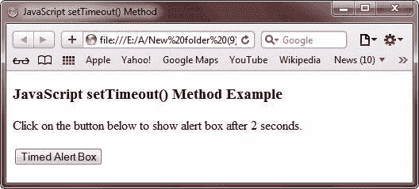
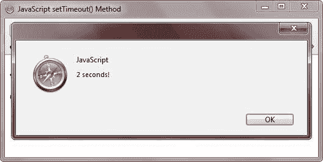

# JavaScript `setTimeout()`方法

> 原文：<https://codescracker.com/js/js-settimeout-method.htm>

JavaScript 中的 setTimeout()方法用于指定代码执行的时间间隔。

您可以使用 setTimeout()方法来延迟特定代码的执行。

## JavaScript `setTimeout()`方法示例

下面的例子演示了 JavaScript 中的 setTimeout()方法:

```
<!DOCTYPE HTML>
<html>
<head>
   <title>JavaScript `setTimeout()` Method</title>
   <script type="text/javascript">
      function timemsg()
      {
         var st = setTimeout("alert('2 seconds!')", 2000);
      }
   </script>
</head>
<body>

<h3>JavaScript `setTimeout()` Method Example</h3>
<p>Click on the button below to show alert box after 2 seconds.</p>
<form>
   <input type="button" value="Timed Alert Box" onClick="timemsg()">
</form>

</body>
</html>
```

下面是上述 JavaScript `setTimeout()`方法示例的一些输出示例。这是最初的输出:



现在按下**定时提醒框**按钮，等待 2 秒钟，你会看到一个提醒框，2 秒钟后会出现。 这里是按下**定时提醒框**2 秒后的快照:



下面是 JavaScript 中上述 setTimeout()方法示例的实时演示输出。

点击下面的按钮，2 秒钟后显示警告框。

<form><input type="button" value="Timed Alert Box" onclick="timemsg()"></form>

[JavaScript 在线测试](/exam/showtest.php?subid=6)

* * *

* * *