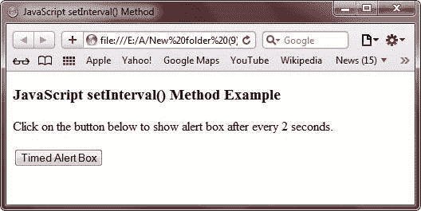
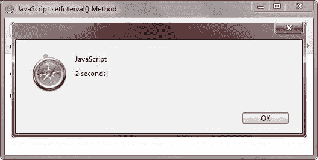

# JavaScript `setInterval()`方法

> 原文：<https://codescracker.com/js/js-setinterval-method.htm>

JavaScript 中的 setInterval()方法用于在每个指定的时间间隔后执行代码。

## JavaScript `setInterval()`方法示例

下面的例子演示了 JavaScript 中的 setInterval()方法:

```
<!DOCTYPE HTML>
<html>
<head>
   <title>JavaScript `setInterval()` Method</title>
   <script type="text/javascript">
      function timemsg()
      {
         var si = setInterval("alert('2 seconds!')", 2000);
      }
   </script>
</head>
<body>

<h3>JavaScript `setInterval()` Method Example</h3>
<p>Click on the button below to show alert box after every 2 seconds.</p>
<form>
   <input type="button" value="Timed Alert Box" onClick="timemsg()">
</form>

</body>
</html>
```

下面是 JavaScript 示例中上述 setInterval()方法的示例输出。这是最初的输出:



这是按下按钮**定时警告框**后，2 秒后产生的输出:



下面是上面的 JavaScript 中的 setInterval()方法示例程序产生的实时演示输出。

点击下面的按钮，每 2 秒钟显示一次警告框。

<form><input type="button" value="Timed Alert Box" onclick="timemsg()"></form>

[JavaScript 在线测试](/exam/showtest.php?subid=6)

* * *

* * *