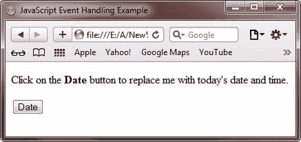
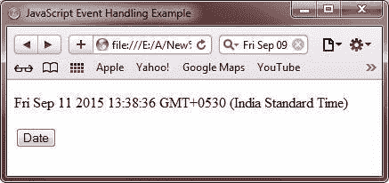
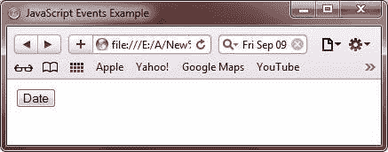
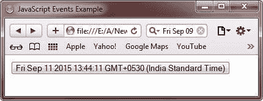

# JavaScript 事件

> 原文：<https://codescracker.com/js/js-events.htm>

JavaScript 中的事件是指当您执行特定任务时，JavaScript 程序检测到的动作。例如， [onclick 事件](/js/js-onclick-event.htm)在您点击鼠标按钮时被程序检测到。这里，下面的代码片段 展示了如何用 JavaScript 创建一个事件处理程序:

```
onEvent = "code to handle the event"
```

您将详细了解 JavaScript 中的所有事件，分为以下教程:

*   [JavaScript `onclick`事件](/js/js-onclick-event.htm)
*   [JavaScript `onload`事件](/js/js-onload-event.htm)
*   [JavaScript 鼠标事件](/js/js-mouse-events.htm)
*   [JavaScript `onreset`事件](/js/js-onreset-event.htm)
*   [JavaScript `onsubmit`事件](/js/js-onsubmit-event.htm)

## JavaScript 事件示例

下面是一个例子，展示了 JavaScript 中的事件处理。本示例将在您点击按钮**点击此处**时显示数据:

```
<!DOCTYPE html>
<html>
<head>
   <title>JavaScript Event Handling Example</title>
</head>
<body>

<p id="event_para1">Click on the <b>Date</b> button to replace me with today's date and time.</p>
<button onclick="getElementById('event_para1').innerHTML=Date()">Date</button>

</body>
</html>
```

下面是上面的 JavaScript 事件处理示例程序显示的输出。这是最初的输出:



现在点击**日期**按钮改变输出，如下图所示:



下面是上面的事件处理示例程序产生的实时演示输出。

点击**日期**按钮，用今天的日期和时间替换我。

<button onclick="getElementById('event_para1').innerHTML=Date()">Date</button>

下面是另一个改变自身元素内容的例子:

```
<!DOCTYPE html>
<html>
<head>
   <title>JavaScript Events Example</title>
</head>
<body>

<button onclick="this.innerHTML=Date()">Date</button>

</body>
</html>
```

下面是上面的 JavaScript 事件处理程序产生的输出。这是最初的输出:



这是点击**日期**按钮后产生的输出。



下面是上面的 JavaScript 事件处理示例的实时演示输出。

<button onclick="this.innerHTML=Date()">Date</button>

[JavaScript 在线测试](/exam/showtest.php?subid=6)

* * *

* * *