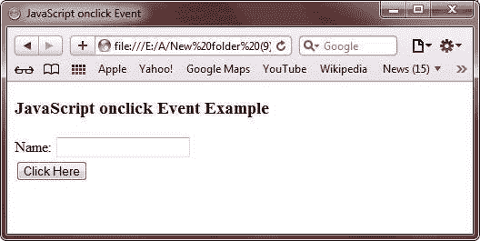
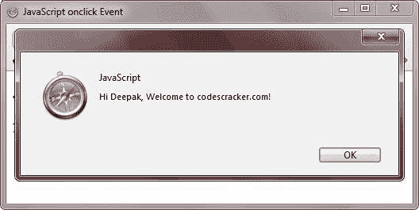

# JavaScript `onclick`事件

> 原文：<https://codescracker.com/js/js-onclick-event.htm>

JavaScript 中的 onclick 事件只是在您单击特定控件(如按钮控件)时触发。

## JavaScript `onclick`事件示例

下面是一个用 JavaScript 演示 onclick 事件的例子:

```
<!DOCTYPE HTML>
<html>
<head>
   <title>JavaScript onclick Event</title>
</head>
<body>

<h3>JavaScript onclick Event Example</h3>
<form name="myform">
   Name: <input type="text" id="name" value=" "><br/>
   <button onclick="alert('Hi ' + document.getElementById('name').value + ', Welcome to codescracker.com!')">Click Here</button>
</form>

</body>
</html>
```

下面是上述 JavaScript `onclick`事件示例的输出示例。这是最初的输出:



现在输入你的名字，按下**点击这里**按钮，按下该按钮后，你会看到一个提示框，显示一条 提示信息，如下图所示:



下面是 JavaScript 中上述 onclick 事件产生的实时演示输出。

<form name="myform">Name: <input type="text" id="name" value=" ">
<button onclick="alert('Hi ' + document.getElementById('name').value + ', Welcome to codescracker.com!')">Click Here</button></form>

[JavaScript 在线测试](/exam/showtest.php?subid=6)

* * *

* * *