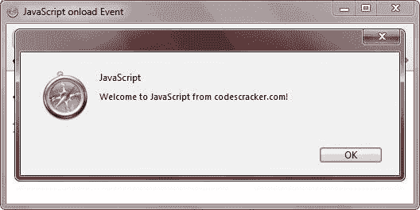

# JavaScript onload 事件

> 原文：<https://codescracker.com/js/js-onload-event.htm>

当网页在浏览器中加载时，JavaScript 中的 onload 事件触发。

**注意**-onload 事件是在 BODY 元素中定义的。

## JavaScript onload 事件示例

下面是一个用 JavaScript 演示 onload 事件的例子:

```
<!DOCTYPE HTML>
<html>
<head>
   <title>JavaScript onload Event</title>
</head>
<body onload="alert('Welcome to JavaScript from codescracker.com!')">

<h3>JavaScript onload Event Example</h3>
<p>You will see an alert box showing an alert message on body load.</p>

</body>
</html>
```

以下是上述 JavaScript onload 事件示例的输出示例:



[JavaScript 在线测试](/exam/showtest.php?subid=6)

* * *

* * *