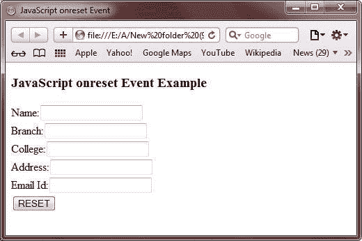
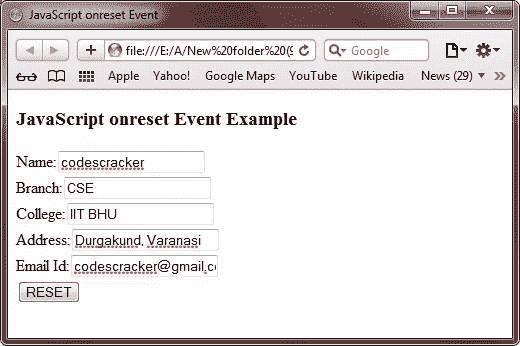
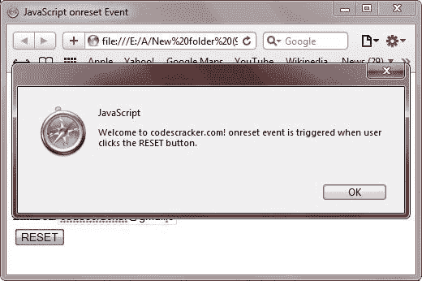
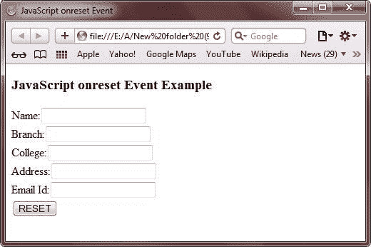

# JavaScript onreset 事件

> 原文：<https://codescracker.com/js/js-onreset-event.htm>

JavaScript 中的 onreset 事件是用表单定义的，当表单的字段被重置时触发。

## JavaScript onreset 事件示例

下面是一个用 JavaScript 演示 onreset 事件的例子:

```
<!DOCTYPE HTML>
<html>
<head>
   <title>JavaScript onreset Event</title>
</head>
<body>

<h3>JavaScript onreset Event Example</h3>
<form onreset="alert('Welcome to codescracker.com! onreset event is triggered when user clicks the RESET button.')">
   Name:<input type="text" name="name" value=" "><br/>
   Branch:<input type="text" name="branch" value=" "><br/>
   College:<input type="text" name="clg" value=" "><br/>
   Address:<input type="text" name="adr" value=" "><br/>
   Email Id:<input type="text" name="eid" value=" "><br/>
   <input type="reset" value="RESET">
</form>

</body>
</html>
```

以下是 JavaScript 中上述 onreset 事件示例的一些示例输出。这是最初的输出:



现在填写所有字段，如下图所示:



填写完所有字段后，只需点击**重置**按钮即可重置所有字段。下面是点击**复位**按钮上的 后产生的输出样本:



现在点击 **OK** 按钮重置所有字段，这里是点击 **OK** 按钮后的快照:



下面是上面的 JavaScript onreset 事件示例产生的实时演示输出。

<form onreset="alert('Welcome to codescracker.com! onreset event is triggered when user clicks the RESET button.')">Name:<input type="text" name="name" value=" ">
Branch:<input type="text" name="branch" value=" ">
College:<input type="text" name="clg" value=" ">
Address:<input type="text" name="adr" value=" ">
Email Id:<input type="text" name="eid" value=" ">
<input type="reset" value="RESET"></form>

[JavaScript 在线测试](/exam/showtest.php?subid=6)

* * *

* * *