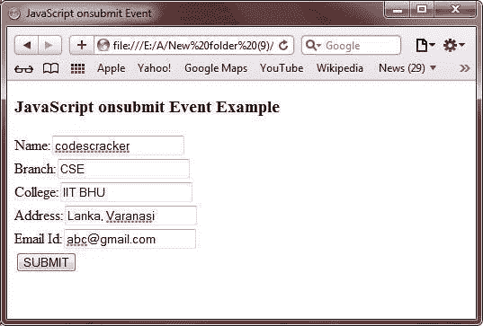

# JavaScript `onsubmit`事件

> 原文：<https://codescracker.com/js/js-onsubmit-event.htm>

JavaScript 中的 onsubmit 事件用于 FORM 元素，在提交表单时触发。

## JavaScript `onsubmit`事件示例

下面是一个用 JavaScript 演示 onsubmit 事件的例子:

```
<!DOCTYPE HTML>
<html>
<head>
   <title>JavaScript onsubmit Event</title>
</head>
<body>

<h3>JavaScript onsubmit Event Example</h3>
<form onsubmit="alert('Form Submitted Successfully!')">
   Name:<input type="text" name="name"><br/>
   Branch:<input type="text" name="branch"><br/>
   College:<input type="text" name="clg"><br/>
   Address:<input type="text" name="adr"><br/>
   Email Id:<input type="text" name="eid"><br/>
   <input type="submit" value="SUBMIT">
</form>

</body>
</html>
```

下面是上述 JavaScript `onsubmit`事件示例的一些输出示例。这是最初的输出:


现在填写所有字段，如下图所示:



填写完所有字段后，点击**提交**按钮，你会看到一个提示框，提示**表单提交成功！**。 下面是这个输出的快照:


下面是上面的 JavaScript `onsubmit`事件示例程序产生的现场演示输出。

<form onsubmit="alert('Form Submitted Successfully!')">Name:<input type="text" name="name">
Branch:<input type="text" name="branch">
College:<input type="text" name="clg">
Address:<input type="text" name="adr">
Email Id:<input type="text" name="eid">
<input type="submit" value="SUBMIT"></form>

[JavaScript 在线测试](/exam/showtest.php?subid=6)

* * *

* * *