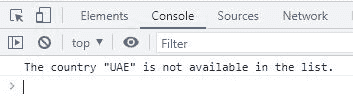

# JavaScript indexOf() |获取数组中值的第一个索引

> 原文：<https://codescracker.com/js/js-indexOf-array.htm>

JavaScript **indexOf()** 方法用于查找数组中指定值的第一个索引。举 的例子:

HTML with JavaScript Code

```
<!DOCTYPE html>
<html>
<body>

<p>Index of "UK" = <span id="codescracker"></span></p>

<script>
   const countries = ["Luxembourg", "USA", "Australia", "UK", "Finland", "Canada"];
   let x = countries.indexOf("UK");

   document.getElementById("codescracker").innerHTML = x;
</script>

</body>
</html>
```

Output

“英国”的索引=

## JavaScript indexOf() Syntax

JavaScript 中 **indexOf()** 方法的语法是:

```
array.indexOf(item, startIndex)
```

**项**是指需要获取索引号的项或值或元素。 **startIndex** 参数为<u>可选</u>，用于从特定的索引号开始搜索指定的**项** 。例如:

HTML with JavaScript Code

```
<!DOCTYPE html>
<html>
<body>

<p>Index = <span id="myspan"></span></p>

<script>
   const ctrs = ["Luxembourg", "USA", "Australia", "UK", "USA", "Canada"];
   let myi = ctrs.indexOf("USA", 2);

   document.getElementById("myspan").innerHTML = myi;
</script>

</body>
</html>
```

Output

Index =

**注-** 分度从 **0** 开始。因此**澳大利亚**排在第二位。

### 如果指定的元素在给定的数组中不可用怎么办？

让我们来看看，如果指定的项目在给定的数组中不可用，会发生什么:

HTML with JavaScript Code

```
<!DOCTYPE html>
<html>
<body>

<p>Index of "UAE" = <span id="myspn"></span></p>

<script>
   const crs = ["Luxembourg", "USA", "Australia", "UK", "USA", "Canada"];
   let i = crs.indexOf("UAE", 2);

   document.getElementById("myspn").innerHTML = i;
</script>

</body>
</html>
```

Output

“阿联酋”指数=

也就是说，如果没有找到指定的项目， **indexOf()** 方法将返回 **-1** 。因此，我们 可以像这样使用 JavaScript 代码来避免打印返回值本身。

HTML with JavaScript Code

```
<!DOCTYPE html>
<html>
<body>

   <script>
      const c = ["Luxembourg", "USA", "Australia", "UK", "USA", "Canada"];
      let nx = c.indexOf("UAE", 2);

      if(nx == -1)
         console.log("The country \"UAE\" is not available in the list.");
      else
         console.log("Index of \"UAE\" = ", nx);
   </script>

</body>
</html>
```

下面给出的快照显示了上面的 JavaScript 示例产生的示例输出:



[JavaScript 在线测试](/exam/showtest.php?subid=6)

* * *

* * *