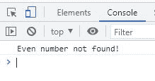

# JavaScript `findIndex()` |获取满足条件的第一个元素的索引

> 原文：<https://codescracker.com/js/js-findIndex-array.htm>

JavaScript **findIndex()** 方法类似于 [find()](/js/js-find-array.htm) 方法， 除了它返回元素的索引号，而不是元素本身。也就是说， **findIndex()** 方法返回给定数组中满足给定条件的第一个元素的索引号。以 为例:

HTML with JavaScript Code

```
<!DOCTYPE html>
<html>
<body>

   <p>The first even value is at Index Number: <span id="xyz"></span></p>

   <script>
      const numbers = [13, 32, 43, 54, 40];

      let firstEvenNumIndex = numbers.findIndex(findFirstEvenIndx);

      function findFirstEvenIndx(x)
      {
         return x%2==0;
      }

      document.getElementById("xyz").innerHTML = firstEvenNumIndex;
   </script>

</body>
</html>
```

Output

第一个偶数值位于索引号:

但是，您也可以使用返回的索引号来访问值本身。例如:

HTML with JavaScript Code

```
<!DOCTYPE html>
<html>
<body>

   <p>The first even number is: <span id="abc"></span></p>

   <script>
      const arr = [13, 32, 43, 54, 40];

      let fi = arr.findIndex(findFE);

      function findFE(x)
      {
         return x%2==0;
      }

      document.getElementById("abc").innerHTML = arr[fi];
   </script>

</body>
</html>
```

Output

第一个偶数是:

**注-** 索引从 0 开始。因此，索引号 1 指的是第二个元素，而不是第一个元素。

## JavaScript `findIndex()`语法

JavaScript 中 **findIndex()** 方法的语法是:

```
array.findIndex(functionName(currentElementValue, currentElementIndex, currentElementArray), thisValue)
```

**函数名**和**当前值**是必需的。

**注-****函数名**是指对**数组**的每一个元素执行的函数，直到 函数内给定的条件满足。

**注意-****currentElementValue**基本上指的是一个变量，该变量将作为 参数传递给函数，该函数当然指示指定数组的当前值/元素。

**注-****currentElementIndex**是指当前元素的索引

**注-****currentElementArray**是指当前元素的数组。

**注-****this value**是指传递给指定函数 **functionName** 作为其 *this* 值的一个值。默认值是**未定义**

如果给定数组中没有元素满足给定条件，则 **findIndex()** 方法返回 **-1** 。 例如:

HTML with JavaScript Code

```
<!DOCTYPE html>
<html>
<body>

   <script>
      const myarray = [13, 33, 45];

      let firstEvnNmIdx = myarray.findIndex(myfunction);

      function myfunction(x)
      {
         return x%2==0;
      }

      if(firstEvnNmIdx == -1)
         console.log("Even number not found!");
      else
         console.log("The first even number is: ", myarray[firstEvnNmIdx]);
   </script>

</body>
</html>
```

下面给出的快照显示了上述示例产生的示例输出:



[JavaScript 在线测试](/exam/showtest.php?subid=6)

* * *

* * *