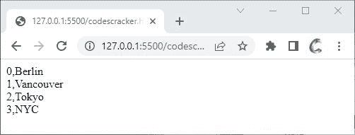

# JavaScript `entries()` |将数组转换为迭代器对象

> 原文：<https://codescracker.com/js/js-entries-array.htm>

JavaScript **entries()** 方法返回一个*对象数组迭代器*，该迭代器显然是键/值 对。例如:

HTML with JavaScript Code

```
<!DOCTYPE html>
<html>
<body>

   <script>
      const a = ["Berlin", "Vancouver", "Tokyo", "NYC"];

      const b = a.entries();

      for(let x of b)
      {
         document.write(x);
         document.write("<BR>");
      }
   </script>

</body>
</html>
```

下面给出的快照显示了上面的 JavaScript 示例产生的示例输出:



**注-**[为...循环用于遍历一个 可迭代对象的值。](/js/js-for-loop.htm)

## JavaScript `条目()`语法

JavaScript 中的 **entries()** 方法的语法是:

```
array.entries()
```

[JavaScript 在线测试](/exam/showtest.php?subid=6)

* * *

* * *