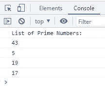

# JavaScript filter() |根据条件过滤数组

> 原文：<https://codescracker.com/js/js-filter-array.htm>

JavaScript **filter()** 方法用于当我们需要检查数组中的每个元素以发现它是否 满足指定的条件，并创建一个只包含那些满足指定的 条件的元素的新数组时。例如:

HTML with JavaScript Code

```
<!DOCTYPE html>
<html>
<body>

   <p id="xyz"></p>

   <script>
      const mynumbers = [12, 32, 43, 5, 65, 46];

      document.getElementById("xyz").innerHTML = mynumbers.filter(even);

      function even(x)
      {
         return x%2==0;
      }
   </script>

</body>
</html>
```

Output

正如你在上面的例子中看到的，使用 **filter()** 方法，我过滤了数组 **mynumbers** 中的偶数。

**注意-** 原始数组不受**滤波器()**方法的影响。

## JavaScript filter()语法

JavaScript 中 **filter()** 方法的语法是:

```
array.filter(functionName(currentElementValue, currentElementIndex, currentElementArray), thisValue)
```

需要**数组**、**函数名**和**当前值**。所有其他选项都是可选的。

**注意-****数组**指的是将要滤波的数组，使用函数 **functionName** 。

**注-****函数名**是指为**数组**的每个元素执行的函数。

**注意-****currentElementValue**基本上指的是一个变量，该变量将作为 参数传递给函数，该函数当然指示指定数组的当前值/元素。

**注-****currentElementIndex**是指当前元素的索引

**注-****currentElementArray**是指当前元素的数组。

**注-****this value**是指传递给指定函数 **functionName** 作为其 *this* 值的一个值。默认值是**未定义**

## JavaScript filter()数组示例

让我创建一个使用带有三个参数的函数的 **filter()** 方法的例子:

HTML with JavaScript Code

```
<!DOCTYPE html>
<html>
<body>

   <p>Odd Numbers: <span id="abc"></span></p>

   <script>
      const a = [12, 32, 43, 5, 65, 46, 19, 17, 48];

      const o = a.filter(odd);

      function odd(num, indx, arr)
      {
         if(indx==0 || indx==(arr.length-1))
            return true;

         return num%2!=0;
      }

      document.getElementById("abc").innerHTML = o;

   </script>

</body>
</html>
```

Output

奇数:

在上面的例子中，第一个和最后一个数字是偶数，即 **12** 和 **48** ，但是我已经 过滤了数组 **a** 来过滤除了第一个和最后一个索引处的元素之外的所有元素。

这是另一个基于质数过滤数组的 **filter()** 函数的例子。

HTML with JavaScript Code

```
<!DOCTYPE html>
<html>
<body>

   <script>
      const nums = [12, 32, 43, 5, 65, 46, 19, 17];

      const primeNums = nums.filter(prime);

      function prime(num)
      {
         let count=0;
         for(let i=2; i<num; i++)
         {
            if(num%i == 0)
            {
               count++;
               break;
            }
         }
         if(count==0)
            return true;
         else
            return false;
      }

      let primeNumsLen = primeNums.length;

      if(primeNumsLen==0)
         console.log("No prime numbers found in the array");
      else
      {
         console.log("List of Prime Numbers:");
         for(let i=0; i<primeNumsLen; i++)
            console.log(primeNums[i]);
      }
   </script>

</body>
</html>
```

下面给出的快照显示了上述示例产生的示例输出:



[JavaScript 在线测试](/exam/showtest.php?subid=6)

* * *

* * *