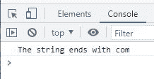

# JavaScript endsWith() |检查字符串是否以子字符串结尾

> 原文：<https://codescracker.com/js/js-endsWith-string.htm>

当我们需要检查一个 [字符串](/js/js-strings.htm)是否以指定的子串结尾时，使用 JavaScript **endsWith()** 方法。例如:

HTML with JavaScript Code

```
<!DOCTYPE html>
<html>
<body>

   <script>
      let myString = "codescracker.com";
      let mySubString = "com";

      if(myString.endsWith(mySubString))
         console.log("The string ends with", mySubString);
      else
         console.log("The string does not ends with", mySubString);
   </script>

</body>
</html>
```

下面给出的快照显示了上述示例产生的示例输出:



## JavaScript endsWith()语法

JavaScript 中 **endsWith()** 方法的语法是:

```
string.endsWith(subString, length)
```

**长度**参数是可选的。它的默认值是**字符串**的长度。

如果以指定的**子串**结束，则 **endsWith()** 方法返回 **true** ，否则 返回 **false** 。

## 检查字符串是否以 JavaScript 中指定的值结尾

HTML with JavaScript Code

```
<!DOCTYPE html>
<html>
<body>

   <p id="xyz"></p>

   <script>
      let myStr = "JavaScript is Fun";
      document.getElementById("xyz").innerHTML = myStr.endsWith("Fun");
   </script>

</body>
</html>
```

Output

由于字符串 **myStr** 包含 **Fun** 作为它的最后一个值，因此 **true** 就是上例中产生的输出 。

[JavaScript 在线测试](/exam/showtest.php?subid=6)

* * *

* * *