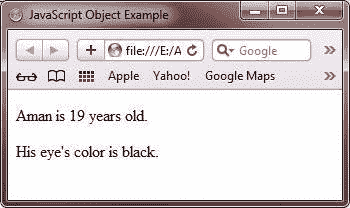
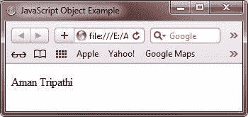

# JavaScript 对象

> 原文：<https://codescracker.com/js/js-objects.htm>

众所周知，JavaScript 语言完全基于对象。

在 JavaScript 中，创建对象有以下两种选择:

*   通过创建对象的直接实例
*   通过使用函数创建对象

JavaScript 中对象的直接实例是通过使用 **new** 关键字创建的。下面的通用形式展示了如何在 JavaScript 中通过创建对象的直接实例来创建 对象:

```
Obj = new object();
```

在 JavaScript 中，您可以自由地向对象添加属性和方法，只需使用点(.)后跟属性或方法名，如下面的代码片段所示:

```
Obj.name="Deepak";
Obj.branch="CSE";
Obj.rollno=15;
Obj.getValue();
```

从上面的代码片段来看， **Obj** 是新创建的对象， **name** ， **branch** ， **rollno** 是它的属性， 和 **getValue()** 是它的方法。

您将学习 JavaScript 中关于 Object 的所有内容，分为以下几个教程:

*   [JavaScript 数字对象](/js/js-numbers.htm)
*   [JavaScript 数组对象](/js/js-arrays.htm)
*   [JavaScript 字符串对象](/js/js-strings.htm)
*   [JavaScript 布尔对象](/js/js-booleans.htm)
*   [JavaScript 数学对象](/js/js-math-object.htm)
*   [JavaScript RegExp 对象](/js/js-regexp-object.htm)
*   [JavaScript 日期对象](/js/js-dates.htm)

## JavaScript 对象示例

这些值以名称:值对的形式写入(名称和值用冒号分隔)。这是一个 JavaScript 中的对象的例子

```
<!DOCTYPE html>
<html>
<head>
   <title>JavaScript Object Example</title>
</head>
<body>

<p id="object_para1"></p>
<p id="object_para2"></p>
<script>
   var object_var = {firstName:"Aman", lastName:"Tripathi", age:19, eyeColor:"black"};
   document.getElementById("object_para1").innerHTML = object_var.firstName + " is " + object_var.age + " years old.";
   document.getElementById("object_para2").innerHTML = "His eye's color is " + object_var.eyeColor + ".";
</script>

</body>
</html>
```

下面是上面的 JavaScript 对象示例程序产生的输出。



下面是上面的 JavaScript 对象示例产生的实时演示输出。

## 在 JavaScript 中访问对象属性

下面的例子展示了如何在 JavaScript 中访问对象的属性。

```
<!DOCTYPE html>
<html>
<head>
   <title>JavaScript Object Example</title>
</head>
<body>

<p id="object_para2"></p>
<script>
   var object_var2 = {
      firstName : "Aman",
      lastName : "Tripathi",
   };
   document.getElementById("object_para2").innerHTML = object_var2.firstName + " " + object_var2.lastName;
</script>

</body>
</html>
```

下面是上面的 JavaScript 对象示例产生的输出。



## JavaScript 中的访问对象方法

下面的例子展示了如何在 JavaScript 中访问 object 的方法。

```
<!DOCTYPE html>
<html>
<head>
   <title>JavaScript Object Example</title>
</head>
<body>

<p id="object_para3"></p>
<script>
   var object_var3 = {
      firstName: "Aman",
      lastName : "Tripathi",
      fullName : function(c) {
         return this.firstName + " " + this.lastName;
      }
   };
   document.getElementById("object_para3").innerHTML = object_var3.fullName();
</script>

</body>
</html>
```

您将看到与上面示例中相同的输出。

[JavaScript 在线测试](/exam/showtest.php?subid=6)

* * *

* * *