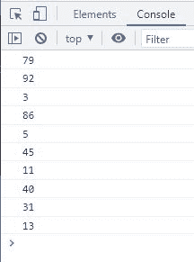

# JavaScript `Math.random()` |生成随机数

> 原文：<https://codescracker.com/js/js-Math-random.htm>

JavaScript **Math.random()** 方法在我们需要生成随机数时使用。 此方法生成/返回一个介于 0 和 1 之间的随机数，其中 0 包含在内，1 不包含在内。 例如:

HTML with JavaScript Code

```
<!DOCTYPE html>
<html>
<body>

   <p id="xyz"></p>

  <script>
    let randomNum = Math.random();
    document.getElementById("xyz").innerHTML = randomNum;
  </script>

</body>
</html>
```

Output

现在，您可以根据自己的选择，使用以下任何方法对生成的随机数进行舍入:

*   [Math.ceil()](/js/js-Math-ceil.htm) -将一个数向上舍入到最接近的最大整数。
*   [Math.floor()](/js/js-Math-floor.htm) -将一个数向上舍入到最接近的最小整数。
*   [Math.round()](/js/js-Math-round.htm) -将指定的数字舍入到最接近的整数值。
*   [toFixed()](/js/js-toFixed-number.htm) -将数字四舍五入到特定的小数位数。
*   [top precision()](/js/js-toPrecision-number.htm)-将数字格式化为特定长度。
*   [Math.trunc()](/js/js-Math-trunc.htm) -求一个数的整数部分。

## JavaScript `Math.random()`语法

JavaScript 中 **Math.random()** 方法的语法是:

```
Math.random()
```

它返回一个范围从 0(包括 0)到 1(不包括 1)的数字。

## JavaScript 生成从 1 到 100 随机数

HTML with JavaScript Code

```
<!DOCTYPE html>
<html>
<body>

   <p id="xyz"></p>

  <script>
    document.getElementById("xyz").innerHTML = Math.random() * 100;
  </script>

</body>
</html>
```

Output

### 在 1 到 100 之间找出 10 个不带小数的随机数

现在让我生成 10 个 1 到 100 之间的随机数，不带小数部分:

HTML with JavaScript Code

```
<!DOCTYPE html>
<html>
<body>

  <script>
    let rn;
    for(let i=0; i<10; i++)
    {
      rn = Math.random() * 100;
      console.log(Math.trunc(rn));
    }
  </script>

</body>
</html>
```

下面给出的快照显示了上面的 JavaScript 示例产生的示例输出:



[JavaScript 在线测试](/exam/showtest.php?subid=6)

* * *

* * *