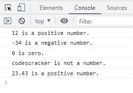

# JavaScript `Math.sign()` |检查数字是正数、零还是负数

> 原文：<https://codescracker.com/js/js-Math-sign.htm>

当我们需要检查一个数字是正数、 零还是负数时，就会用到 JavaScript **Math.sign()** 方法。如果指定的数字是正数，该方法返回 **1** 。 否则返回 **0** 和 **-1** 如果指定数为零或负数。以 为例:

HTML with JavaScript Code

```
<!DOCTYPE html>
<html>
<body>

  <p id="xyz"></p>

  <script>
    let num = -32;
    document.getElementById("xyz").innerHTML = Math.sign(num);
  </script>

</body>
</html>
```

Output

## JavaScript `Math.sign()`语法

JavaScript 中 **Math.sign()** 方法的语法是:

```
Math.sign(x)
```

参数 **x** 指的是一个数字。

**请注意:**如果指定的 **x** (作为 **Math.sign()** 参数的数字)不是 数字，则**返回 NaN** 。否则，如果指定的 **x** 为正数、零或负数，则返回 **1** 、 **0** 或 **-1** 。

## JavaScript `Math.sign()`示例

HTML with JavaScript Code

```
<!DOCTYPE html>
<html>
<body>

  <script>
    let myArray = [12, -34, 0, "codescracker", 23.43];

    for(let i=0; i<myArray.length; i++)
    {
      if(Math.sign(myArray[i]) == 1)
        console.log(myArray[i] + " is a positive number.");
      else if(Math.sign(myArray[i]) == 0)
        console.log(myArray[i] + " is zero.");
      else if(Math.sign(myArray[i]) == -1)
        console.log(myArray[i] + " is a negative number.");
      else
        console.log(myArray[i] + " is not a number.");
    }
  </script>

</body>
</html>
```

下面给出的快照显示了上面的 JavaScript 示例产生的示例输出:



[JavaScript 在线测试](/exam/showtest.php?subid=6)

* * *

* * *