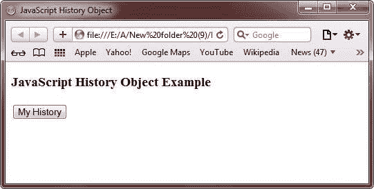

# JavaScript 历史对象

> 原文：<https://codescracker.com/js/js-history-object.htm>

历史对象是 JavaScript 中预定义的对象，由 URL 的[数组](/js/js-arrays.htm)组成，用户在浏览器中访问这些 URL 的 。

历史对象具有以下特征:

*   性能
*   方法

## JavaScript 历史对象属性

下表列出了 JavaScript 中 history 对象的属性。

| 财产 | 描述 |
| 长度 | 指定对象中包含的元素数量 |
| 目前的 | 指定对象中当前条目的 url |
| 然后 | 指定了历史列表中下一个元素的 url |
| 以前的 | 指定历史列表中上一个元素的 URL |

## JavaScript 历史对象方法

下表描述了 JavaScript 中 history 对象的方法。

| 方法 | 描述 |
| 后退() | 指定从历史列表中加载上一个 URL 的方法 |
| 向前() | 指定了从历史列表中加载下一个 url 的方法 |
| 去() | 指定从历史列表中加载特定 URL 的方法 |

## JavaScript 历史对象示例

下面是一个用 JavaScript 演示历史对象的例子:

```
<!DOCTYPE HTML>
<html>
<head>
   <title>JavaScript History Object</title>
   <script type="text/javascript">
      function dispCount()
      {
         var historyCount = history.length;
         alert("Hi, you have visited " + historyCount + " web pages so far.");
      }
   </script>
</head>
<body>

<h3>JavaScript History Object Example</h3>
<form>
   <input type="button" name="history" value="My History" onclick="dispCount()">
</form>

</body>
</html>
```

下面是上面的 JavaScript 历史对象示例代码产生的输出。这是最初的输出:



以下是点击**我的历史**按钮后产生的输出:


让我们再举一个 JavaScript 中历史对象的例子:

```
<!DOCTYPE HTML>
<html>
<head>
   <title>JavaScript History Object</title>
   <script type="text/javascript">
      function funBackward()
      {
         window.history.back()
      }
      function funForward()
      {
         window.history.forward()
      }
      function funGo()
      {
         window.history.go(1)
      }
   </script>
</head>
<body>

<h3>JavaScript History Object Example</h3>
<input type="button" id="btgo" value="Go to Next Link" onclick="funGo();">
<input type="button" id="btfo" value="Forward" onclick="funForward();">
<input type="button" id="btba" value="Backward" onclick="funBackward();">

</body>
</html>
```

以下是上述 JavaScript 示例代码生成的示例输出:


[JavaScript 在线测试](/exam/showtest.php?subid=6)

* * *

* * *