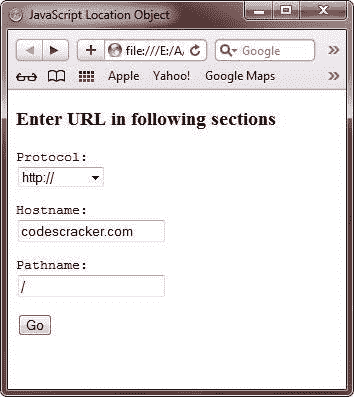
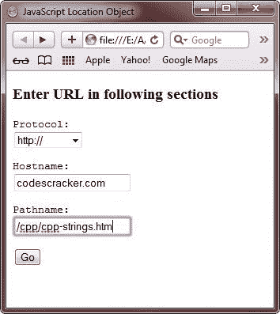
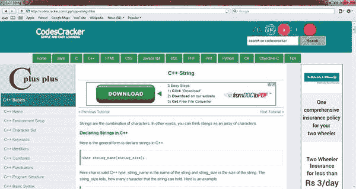

# JavaScript 位置对象

> 原文：<https://codescracker.com/js/js-location-object.htm>

JavaScript 中的 location 对象帮助存储[窗口对象](/js/js-window-object.htm)的当前 URL 信息。 它是窗口对象的子对象。

位置对象有以下两个特征:

*   性能
*   方法

## JavaScript 位置对象属性

下表描述了 JavaScript 中 Location 对象的属性。

| 财产 | 描述 | 例子 |
| href | 表示指定整个 URL 的字符串 | http://codescracker.com:80？test.asp？id = 1 #开始 |
| 草案 | 表示 URL 开头的字符串，直到第一个冒号(:)，它指定访问 URL 的方法 | http:或 https: |
| 宿主 | 表示由主机名和端口字符串组成的字符串 | codescracker.com:80 |
| 主机名 | 表示 URL 的服务器名、子域和域名 | codescracker.com |
| 港口 | 表示指定服务器使用的通信端口的字符串 | Eighty |
| 路径名 | 表示 URL 的字符串部分，指定如何访问特定资源 | test.asp |
| 搜索 | 表示以问号开头的字符串，它指定 HTTP URL 中的任何查询信息 | id=1 |
| 混杂 | 表示以#开头的字符串，指定 HTTP URL 中的定位点名称 | 开始 |

## JavaScript 位置对象方法

下表列出了 JavaScript 中 Location 对象的方法。

| 方法 | 描述 |
| 分配() | 在浏览器中加载新文档 |
| 重新加载() | 重新加载 location.href 属性中包含的当前文档 |
| 替换() | 用指定的新文档替换当前文档，您不能使用浏览器的后退按钮导航回上一个文档 |

## JavaScript 位置对象示例

下面是一个用 JavaScript 演示位置对象的例子:

```
<!DOCTYPE HTML>
<html>
<head>
   <title>JavaScript Location Object</title>
   <script type="text/javascript">
      function gotoUrl()
      {
         window.location.href = window.document.loctn.ProtocolFld.
         options[window.document.loctn.ProtocolFld.selectedIndex].
         text + document.loctn.HostnameFld.value + document.loctn.
         PathnameFld.value
      }
   </script>
</head>
<body>

<h3>Enter URL in following sections</h3>
<form name="loctn" method="post">
<pre>Protocol:
<select name="ProtocolFld" size="1">
<option>http://</option>
<option>file://</option>
<option>javascript:</option>
<option>ftp://</option>
<option>mailto:</option>
</select>
</pre>
<pre>
Hostname:
<input type="text" size="20" maxlength="256" name="HostnameFld" value="codescracker.com">
</pre>
<pre>
Pathname:
<input type="text" size="20" maxlength="100" name="PathnameFld" value="/">
</pre>
<pre>
<input type="button" name="Go" value="Go" onclick="gotoUrl()">
</pre>
</form>

</body>
</html>
```

以下是上述 JavaScript 位置对象示例代码的输出示例:



现在填写(或编辑并填写)必填字段，如下图所示:



填写如上图所示的必填字段后，点击 **Go** 按钮转到该 url。以下是点击 **Go** 按钮后 的输出示例:



[JavaScript 在线测试](/exam/showtest.php?subid=6)

* * *

* * *