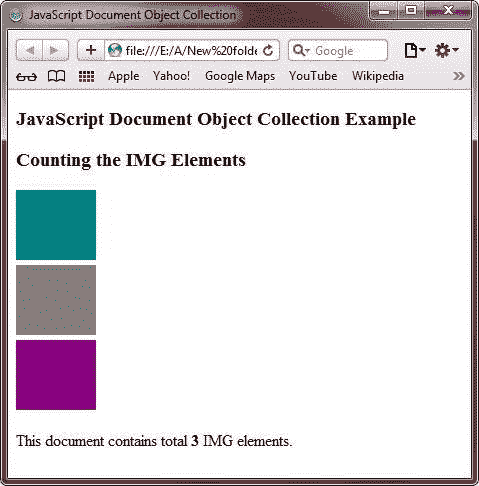

# JavaScript 文档对象集合

> 原文：<https://codescracker.com/js/js-document-object-collection.htm>

如您所知，文档对象充当对象的集合。集合被定义为相关对象的[数组](/js/js-arrays.htm) 。这个对象数组提供了一种方便的方式，可以将一组相关的对象作为单个对象来引用。

下表列出了 JavaScript 中 document 对象的集合元素:

| 收藏品 | 描述 |
| 锚 | 引用一个数组，该数组返回一个 HTML 文档的所有锚点对象 |
| 形式 | 引用一个数组，该数组返回一个 HTML 文档的所有表单对象 |
| 形象 | 指返回 HTML 文档中所有图像对象的数组 |
| 链接 | 指返回文档中所有对象的数组 |

## JavaScript 文档对象集合示例

以下示例演示了 JavaScript 中的文档对象集合:

```
<!DOCTYPE HTML>
<html>
<head>
   <title>JavaScript Document Object Collection</title>
</head>
<body>

<h3>JavaScript Document Object Collection Example</h3>
<h3>Counting the IMG Elements</h3>
   <br/>
   <br/>
   <br/>
   <p>This document contains total <b>
   <script type="text/javascript">
      document.write(document.images.length+" ")
   </script></b>
   IMG elements.</p>

</body>
</html>
```

下面是上面的 JavaScript 文档对象集合示例代码生成的示例输出:



[JavaScript 在线测试](/exam/showtest.php?subid=6)

* * *

* * *