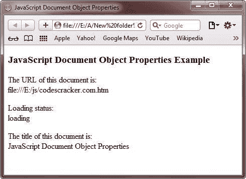

# JavaScript 文档对象属性

> 原文：<https://codescracker.com/js/js-document-object-properties.htm>

文档对象提供了与一个 [HTML](/html/index.htm) 文档相关的各种属性，如 标题属性、url 属性等。

使用此处给出的符号访问属性:

```
objectName.propertyName
```

这里，objectName 是对象的名称，propertyName 是其属性的名称。两者都区分大小写。

下表列出了 JavaScript 中 Document 对象的属性。

| 财产 | 描述 |
| 甜饼干 | 返回包含与文档相关的所有可见和未过期 cookies 的报告 |
| 领域 | 返回产生文档的服务器的域名 |
| 上次修改时间 | 返回文档的最后修改日期 |
| 文档模式 | 返回浏览器处理文档时使用的模式 |
| readyState | 返回文档的加载状态 |
| 推荐人 | 返回 HTML 文档中引用的所有文档的 URL |
| 标题 | 返回在 TITLE 元素的开始和结束标记之间定义的 HTML 文档的名称 |
| 统一资源定位器 | 返回 HTML 文档的完整 URL |

## JavaScript 文档对象属性

下面是一个用 JavaScript 演示文档对象属性的示例:

```
<!DOCTYPE HTML>
<html>
<head>
   <title>JavaScript Document Object Properties</title>
</head>
<body>

<h3>JavaScript Document Object Properties Example</h3>
<p>The URL of this document is:<br/>
<script type="text/javascript">
   document.write(document.URL);
</script></p>
<p>Loading status:<br/>
<script type="text/javascript">
   document.write(document.readyState);
</script></p>
<p>The title of this document is:<br/>
<script type="text/javascript">
   document.write(document.title);
</script></p>

</body>
</html>
```

以下是上述 JavaScript 文档对象属性示例的输出示例:



[JavaScript 在线测试](/exam/showtest.php?subid=6)

* * *

* * *