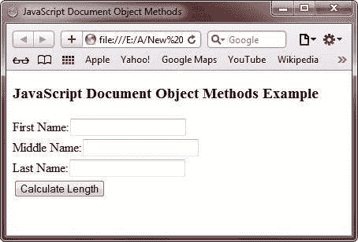
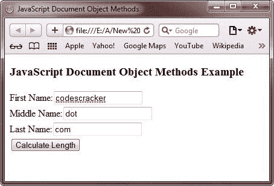
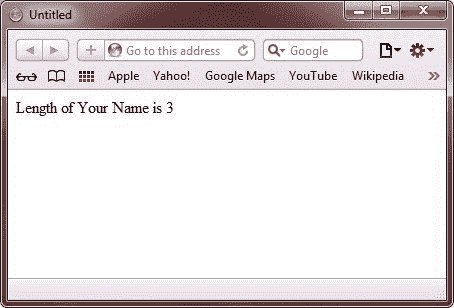

# JavaScript 文档对象方法

> 原文：<https://codescracker.com/js/js-document-object-methods.htm>

文档对象还提供了各种方法来访问 [HTML](/html/index.htm) 元素。 下面是用来调用一个方法的一般形式:

```
objectName.methodName(arguments)
```

## 文档对象的方法列表

以下是 JavaScript 中 document 对象的方法列表:

*   打开()
*   关闭()
*   写()
*   可写()
*   getElementById()
*   getElementsByName()
*   getElementsByTagName()

### JavaScript open()方法

JavaScript open()方法打开一个 HTML 文档来显示输出。下面是 open()方法的一般形式:

```
document.open(mimetype, replace)
```

### JavaScript close()方法

JavaScript close()方法关闭一个 HTML 文档。下面是 close()方法的一般形式:

```
document.close()
```

### JavaScript write()方法

JavaScript write()方法将 HTML 表达式或 JavaScript 代码写入 HTML 文档。下面是 write()方法的一般形式:

```
document.write(exp1, exp2, ...)
```

### JavaScript writeln()方法

JavaScript writeln()方法在每个 HTML 表达式或 JavaScript 代码后写入新的行字符。以下是 writeln()方法的一般情况:

```
document.writeln(exp1, exp2, ...)
```

### JavaScript getElementById()方法

JavaScript getElementById()方法返回具有指定 Id 的 HTML 文档的第一个元素的引用。下面是 getElementById()方法的一般情况:

```
document.getElementById(id)
```

### JavaScript getElementsByName()方法

JavaScript getElementsByName()方法返回指定名称的元素的引用。下面是 getElementsByName()方法的一般形式:

```
document.getElementsByName(name)
```

### JavaScript getElementsByTagName()方法

JavaScript getElementsByTagName()方法返回带有指定标记名的所有元素。下面是 getElementsByTagName()方法的一般形式:

```
document.getElementsByTagName(tagname)
```

## JavaScript 文档对象方法示例

下面的示例演示了 JavaScript 中的文档对象方法:

```
<!DOCTYPE HTML>
<html>
<head>
   <title>JavaScript Document Object Methods</title>
   <script type="text/javascript">
      function getElement()
      {
         new_window = window.open("")
         new_window.document.open()
         var xyz = document.getElementsByName("ab")
         new_window.document.write("Length of Your Name is " + xyz.length)
         new_window.document.close()
      }
   </script>
</head>
<body>

<h3>JavaScript Document Object Methods Example</h3>
First Name:<input type="text" name="ab" size="20"><br/>
Middle Name:<input type="text" name="ab" size="20"><br/>
Last Name:<input type="text" name="ab" size="20"><br/>
<input type="button" onclick="getElement()" value="Calculate Length">

</body>
</html>
```

下面是 JavaScript 中上述文档对象方法示例的示例输出。这是最初的输出:



现在填写所有三个字段，点击**计算长度**按钮，如下图所示:



点击**计算长度**按钮后，这里是输出，您将在浏览器上看到(在新窗口中):



[JavaScript 在线测试](/exam/showtest.php?subid=6)

* * *

* * *