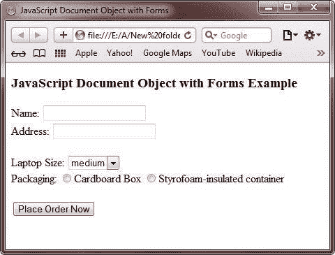
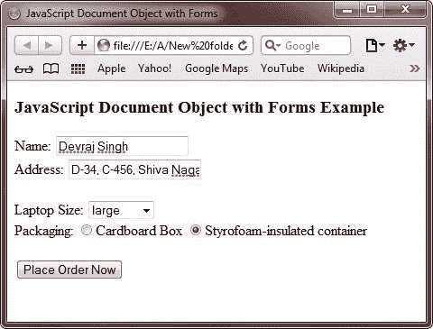
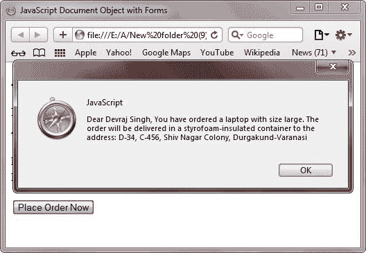

# 带有表单的 JavaScript 文档对象

> 原文：<https://codescracker.com/js/js-document-object-with-forms.htm>

文档对象提供 forms[]属性来选择一个 [HTML](/html/index.htm) 文档的所有表单对象的引用。只需使用表单的索引号或名称，就可以访问单个表单。

## 带有表单的 JavaScript 文档对象示例

下面是一个用 JavaScript 演示文档对象和表单的示例:

```
<!DOCTYPE HTML>
<html>
<head>
   <title>JavaScript Document Object with Forms</title>
   <script type="text/javascript">
      function order()
      {
         var order = "Dear "
         order = order + document.forms[0].Name.value
         order = order + ", You have ordered a laptop with size "
         if(document.forms[0].size.options[0].selected)
         {
            order = order + "small"
         }
         if(document.forms[0].size.options[1].selected)
         {
            order = order + "medium"
         }
         if(document.forms[0].size.options[2].selected)
         {
            order = order + "large"
         }
         order = order + ". The order will be delivered in a "
         if(document.forms[0].packaging[0].checked)
         {
            order = order + "cardboard box"
         }
         if(document.forms[0].packaging[1].checked)
         {
            order = order + "styrofoam-insulated container"
         }
         order = order + " to the address: "
         order = order + document.forms[0].address.value
         alert(order)
      }
   </script>
</head>
<body>

<h3>JavaScript Document Object with Forms Example</h3>
<form action="mailto:shop@codescracker.com" method="post" onSubmit="order()" enctype="text/plain">
   Name: <input name="Name" size="20"><br/>
   Address: <input name="address" size="20"><br/><br/>
   Laptop Size: <select name="size">
      <option>small</option>
      <option selected>medium</option>
      <option>large</option>
   </select><br/>
   Packaging: <input type="radio" name="packaging">Cardboard Box
   <input type="radio" name="packaging">Styrofoam-insulated container<br/><br/>
   <input type="submit" value="Place Order Now">
</form>

</body>
</html>
```

下面是上面的 JavaScript document 对象和 forms 示例产生的示例输出。这是最初的输出:



现在，要下订单，只需填写下图所示的所有字段:



填写完所有字段后，只需点击**现在下单**按钮，您将获得以下输出:



点击 **Ok** 按钮后，会出现一个包含订单详情的新邮件窗口。

[JavaScript 在线测试](/exam/showtest.php?subid=6)

* * *

* * *