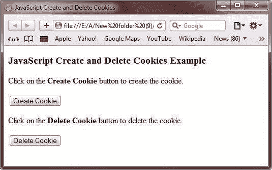
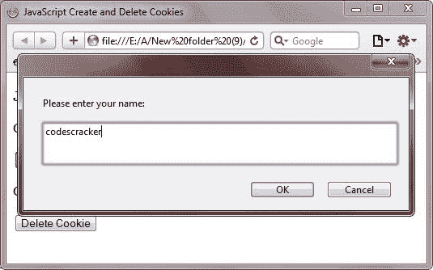
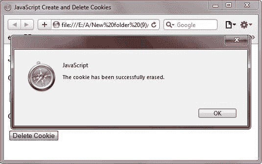

# JavaScript 创建和删除 Cookies

> 原文：<https://codescracker.com/js/js-create-delete-cookies.htm>

众所周知， [cookies](/js/js-cookies.htm) 是包含系统相关信息的小文件。

## JavaScript 创建和删除 Cookies 示例

下面的例子演示了如何用 JavaScript 创建和删除 cookie:

```
<!DOCTYPE HTML>
<html>
<head>
   <title>JavaScript Create and Delete Cookies</title>
   <script type="text/javascript">
   function getCookie(cookie_name)
         {
            if (document.cookie.length>0)
            {
               cookie_start=document.cookie.indexOf(cookie_name + "=");
               if (cookie_start!=-1)
               {
                  cookie_start=cookie_start + cookie_name.length+1;
                  cookie_start=document.cookie.indexOf(";",cookie_start);
                  if (cookie_start==-1) 
                     cookie_start=document.cookie.length;
                     return unescape(document.cookie.substring(cookie_start,cookie_start));
               }
            }
            return "";
         }

         function setCookie(cookie_name,cookie_value,expiredays)
         {
            var exdate=new Date();
            exdate.setDate(exdate.getDate()+expiredays);
            document.cookie=cookie_name+ "=" +escape(cookie_value)+((expiredays==null) ? "" : ";expires="+exdate.toUTCString());
         }

         function checkCookie()
         {

            mycookie=getCookie('mycookie');
            if (mycookie!=null && mycookie!="")
            {
               alert('Welcome again '+mycookie+'! \n The cookies has already been created.');
            }
            else
            {
               mycookie=prompt('Please enter your name:',"");
               if (mycookie!=null && mycookie!="")
               {
                  setCookie('mycookie',mycookie,30);
               }
            }
         }

         function eraseCookie() 
         {
            setCookie('mycookie',"",-1);
            alert('The cookie has been successfully erased.');
         }
   </script>
</head>
<body>

<h3>JavaScript Create and Delete Cookies Example</h3>
<p>Click on the <b>Create Cookie</b> button to create the cookie.</p>
<input type="button" onclick="checkCookie()" value="Create Cookie">
<p>Click on the <b>Delete Cookie</b> button to delete the cookie.</p>
<input type="button" onclick="eraseCookie()" value="Delete Cookie">

</body>
</html>
```

下面是上面 JavaScript 创建和删除 cookie 示例代码的示例输出。这是最初的输出:



要创建 cookie，点击**创建 Cookie** 按钮。点击**创建 Cookie** 按钮后，输入 cookie 的值(名称)，如下图所示:



现在，点击 **OK** 按钮成功创建您的 cookie。要删除 cookie，只需点击**删除 Cookie** 按钮。 点击**删除 Cookie** 按钮后，会得到如下图所示的输出:



[JavaScript 在线测试](/exam/showtest.php?subid=6)

* * *

* * *