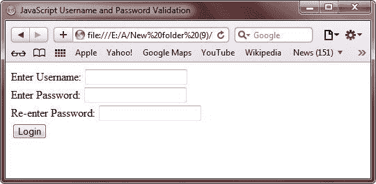
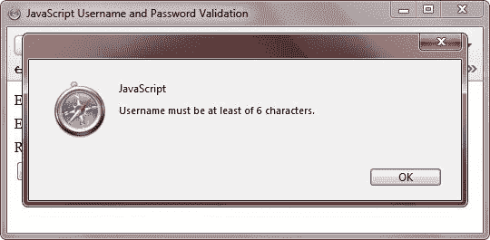
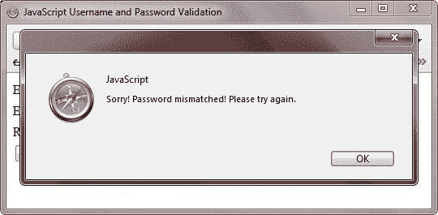
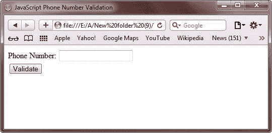

# JavaScript 表单验证

> 原文：<https://codescracker.com/js/js-forms.htm>

如你所知，你可以通过使用表单元素的 [onsubmit](/js/js-onsubmit-event.htm) 属性来验证任何 [HTML 表单](/html/html-forms.htm)。

onsubmit 调用一个[函数](/js/js-functions.htm)，它是通过使用 JavaScript 检查表单 的字段是否有效而创建的。

## JavaScript 必填字段验证

使用 JavaScript，您可以自由地限制用户填充表单字段。下面的示例展示了如何使用 JavaScript 验证必填字段:

```
<!DOCTYPE HTML>
<HEAD>
<TITLE>JavaScript Required Fields Validation</TITLE>
<SCRIPT type="text/javascript">
   function validateRequiredFields(this_form)
   {
      var username=this_form.usrname.value;
      var password=this_form.usrpassword.value;
      if(username==null || username=="")
      {
         alert("Please enter your username");
         this_form.usrname.focus();
         return false;
      }
      if(password==null || password=="")
      {
         alert("Please enter your password");
         this_form.usrpassword.focus();
         return false;
      }
      return true;
   }
</SCRIPT>
</HEAD>
<BODY>

<FORM action="#" onsubmit="return validateRequiredFields(this)" method="Post">
   Username: <input type= "text" name="usrname"/><span style="color:red;">*</span><br/>
   Password: <input type= "password" name="usrpassword"/><span style="color:red;">*</span><br/>
   <INPUT type="submit" value="Login"/>
</FORM>

</BODY>
</HTML>
```

下面是上面的 JavaScript 必填字段表单验证示例程序产生的示例输出。这是最初的输出:


无需输入用户名和密码，只需点击**登录**按钮，您将看到以下输出:


现在输入您的用户名，如下图所示:


输入用户名后，离开密码字段并点击**登录**按钮，然后您将看到以下输出:


下面是上面的 JavaScript 必填字段表单验证示例程序的实时演示输出。

<form action="#" onsubmit="return validateRequiredFields(this)" method="Post">Username: <input type="text" name="usrname">*
Password: <input type="password" name="usrpassword">*
<input type="submit" value="Login"></form>

## JavaScript 数字验证

您可以使用一个名为 **isNaN** 的 JavaScript 函数来验证一个数字对象。下面的例子展示了如何使用 JavaScript 验证数字:

```
<!DOCTYPE HTML>
<HTML>
<HEAD>
   <TITLE>JavaScript Number Validation</TITLE>
   <SCRIPT type="text/javascript">
   function validateNumber(this_form2)
   {   
      var num2 = this_form2.num2.value;
      if(num2==null|| num2=="")
      {
         alert("Please enter a number.");
         this_form2.num2.focus();
         return false;
      }
      if(isNaN(num2))
      {
         alert("It is not a valid number.");
         this_form2.num2.focus();
         return false;
      }   
      return true;   
   }
   </SCRIPT>
</HEAD>
<BODY>

<FORM action="#" onsubmit="return validateNumber(this)" method="Post">
   Enter a Number: <INPUT type="text" name="num2"/><BR/>
   <INPUT type="submit" value="Validate"/>
</FORM>

</BODY>
</HTML>
```

下面是上述 JavaScript 数字验证示例程序的一些输出示例。这是最初的输出:


现在这里是当您点击 **Validate** 按钮而不输入任何数字时产生的输出:


下面是当您输入一个除数字以外的字符并点击 **Validate** 按钮时产生的输出:


下面是上面使用 JavaScript 的数字验证示例的实时演示输出:

<form action="#" onsubmit="return validateNumber(this)" method="Post">Enter a Number: <input type="text" name="num2">
<input type="submit" value="Validate"></form>

## JavaScript 用户名和密码验证

您还可以使用 JavaScript 验证用户名和密码字段，例如检查字段的值是否为空，或者限制值的长度等等。下面的示例展示了如何使用 JavaScript 验证表单的用户名和密码字段:

```
<!DOCTYPE HTML>
<HTML>
<HEAD>
   <TITLE>JavaScript Username and Password Validation</TITLE>
   <SCRIPT type="text/javascript">
   function validateUsernamePassword(this_form3)
   {
      var userName = this_form3.user_name.value;
      var pass1 = this_form3.password1.value;
      var pass2 = this_form3.password2.value;
      if(userName=="")
      {
         alert("Please enter your username.");   
         this_form3.user_name.focus();
         return false;
      }
      if(userName.length<6)
      {
         alert("Username must be at least of 6 characters.");   
         this_form3.user_name.focus();
         return false;
      }
      if(pass1=="")
      {
         alert("Please enter your password.");   
         this_form3.password1.focus();
         return false;
      }
      if(pass1.length<8)
      {
         alert("Password must contain at least of 8 digits");   
         this_form3.password1.focus();
         return false;
      }
      if(pass2=="")
      {
         alert("Please re-enter your password for confirmation.");   
         this_form3.password2.focus();
         return false;
      }
      if(pass1.length>=8 && pass2.length>=8 )
      {
         if(pass1!=pass2)
         {
               alert("Sorry! Password mismatched! Please try again.");   
               return false;
         }
      }   
      return true;
   }
   </SCRIPT>
</HEAD>

<BODY>
<FORM action="#" onsubmit="return validateUsernamePassword(this)" method="Post">
   Enter Username: <INPUT type="text" name="user_name"/><BR/>
   Enter Password: <INPUT type="password" name="password1"/><BR/>
   Re-enter Password: <INPUT type="password" name="password2"/><BR/>
   <INPUT type="submit" value="Login"/>
</FORM>

</BODY>
</HTML>
```

下面是上面的 JavaScript 用户名和密码字段验证示例程序产生的一些示例输出。这是最初的输出:



现在点击**登录**按钮，无需输入任何内容。然后，您将看到以下输出:


现在输入用户名(仅包含 5 个字符)并点击**登录**按钮。然后，您将看到以下输出:



现在输入**密码器**作为用户名和**密码**作为密码，按下**登录**按钮。下面是您将 看到的输出:


现在输入**密码员**作为用户名， **123456789** 作为密码， **123456780** 作为重新输入密码，点击 **登录**按钮。下面是上面的用户名和密码验证程序使用 JavaScript 生成的输出:



下面是上面的 JavaScript 用户名和密码示例程序产生的实时演示输出。

<form action="#" onsubmit="return validateUsernamePassword(this)" method="Post">Enter Username: <input type="text" name="user_name">
Enter Password: <input type="password" name="password1">
Re-enter Password: <input type="password" name="password2">
<input type="submit" value="Login"></form>

## JavaScript 电话号码验证

您还可以使用 JavaScript 验证用户输入的电话号码。要验证电话号码，您必须检查以下三个条件:

*   用户必须输入一个值
*   值必须是整数值
*   值必须至少有 10 位数字

下面的示例展示了如何使用 JavaScript 验证用户输入的电话号码:

```
<!DOCTYPE HTML>
<HTML>
<HEAD>
   <TITLE>JavaScript Phone Number Validation</TITLE>
   <SCRIPT type="text/javascript">
   function validatePhoneNumber(this_form4)
   {
      var phon=this_form4.phonnumbe.value;
      if(phon==null||phon=="")
      {
         alert("Please enter your phone number.");
         this_form4.phonnumbe.focus();   
         return false;
      }
      if(phon.length<10)
      {
         alert("Phone number must be at least of 10 digits.");
         this_form4.phonnumbe.focus();   
         return false;
      }
      if(isNaN(phon))
      {
         alert("Sorry! You have entered an invalid phone number! Please try again.");
         this_form4.phonnumbe.focus();   
         return false;
      }
      return true;
   }
   </SCRIPT>
</HEAD>
<BODY>

<FORM action="#" onsubmit="return validatePhoneNumber(this)" method="Post">
   Phone Number: <input type="text" name="phonnumbe"/><BR/>
   <INPUT type="submit" value="Validate"/>
</FORM>

</BODY>
</HTML>
```

下面是上面的 JavaScript 电话号码验证示例程序产生的输出示例。这是最初的输出:



现在按下**验证**按钮，不输入任何内容。以下是您将看到的输出:


现在输入 **codescracker** 作为电话号码，并点击 **Validate** 按钮，您将看到以下输出:


下面是上面的电话号码验证示例程序使用 JavaScript 生成的实时演示输出:

<form action="#" onsubmit="return validatePhoneNumber(this)" method="Post">Phone Number: <input type="text" name="phonnumbe">
<input type="submit" value="Validate"></form>

## JavaScript 时间验证

您还可以使用 JavaScript 验证时间。换句话说，您可以使用 JavaScript 检查输入的时间格式是否正确。下面的例子展示了如何使用 JavaScript 验证时间。

```
<!DOCTYPE HTML>
<HTML>
<HEAD>
   <TITLE>JavaScript Time Validation</TITLE>
   <SCRIPT type="text/javascript">
   function validateTime(this_form5)
   {
      var timeVa = this_form5.timeval.value;
      if(timeVa == "")
      {      
         alert("Please enter the Time.");
         this_form5.timeval.focus();
         return false;
      }
      var positio = timeVa.indexOf(":");
      if(positio<0)
      {
         alert("Sorry! You have entered an invalid Time! The colon ( : ) is missing between HH and MM.");
         this_form5.timeval.focus();
         return false;
      }
      if(positio>2 || positio<1)
      {
         alert("Sorry! You have entered an invalid Time! The Time format should be HH:MM AM/PM.");
         this_form5.timeval.focus();
         return false;
      }
      var hours = timeVa.substring(0, positio);   
      if(hours>12)
      {
         alert("Sorry! You have entered an invalid Time! Hours cannot be greater than 12.");
         this_form5.timeval.focus();
         return false;
      }
      if(hours<=0)
      {
         alert("Sorry! You have entered an invalid Time! Hours cannot be smallar than 0.");
         this_form5.timeval.focus();
         return false;
      }
      var min = timeVa.substring(positio+1, positio+3);   
      if(min>59)
      {
         alert("Sorry! You have entered an invalid Time! Mins cannot be greater than 59.");
         this_form5.timeval.focus();
         return false;
      }
      if(min<0)
      {
         alert("Sorry! You have entered an invalid Time! Mins cannot be smallar than 0.");
         this_form5.timeval.focus();
         return false;
      }
      var t1  = timeVa.substring(5,8);   
      if(t1!= "AM" && t1!= "am" && t1!="PM" && t1!= "pm")
      {
         alert("Sorry! You have entered an invalid Time! Time should be end with AM or PM.");
         this_form5.timeval.focus();
         return false;
      }
      return true;   
   }
   </SCRIPT>
</HEAD>

<BODY>
<FORM action="#" onsubmit="return validateTime(this)" method="Post">
   Enter Time (HH:MM AM/PM): <input type="text" name="timeval"/><br/>
   <INPUT type="submit" value="Validate"/>
</FORM>

</BODY>
</HTML>
```

下面是上面的 JavaScript 时间验证示例程序产生的一些示例输出。这是最初的输出:


现在输入 **10 12AM** 并点击**验证**按钮。您将看到以下输出:


下面是上面的时间验证程序使用 JavaScript 生成的实时演示输出。

<form action="#" onsubmit="return validateTime(this)" method="Post">Enter Time (HH:MM AM/PM): <input type="text" name="timeval">
<input type="submit" value="Validate"></form>

## JavaScript 日期验证

您还可以使用 JavaScript 验证用户输入的日期。您可以根据格式验证日期，如 mm/dd/yyyy 格式。在这种格式中，您必须根据 mm/dd/yyyy 格式进行验证，这意味着月份和日期应该正好是 2 位数字，年份应该是 4 位数字，最后所有三个数字(日、月和年)必须用/符号隔开。

下面的示例演示了如何使用 JavaScript 验证用户输入的日期:

```
<!DOCTYPE HTML>
<HTML>
<HEAD>
   <TITLE>JavaScript Date Validation</TITLE>
   <SCRIPT type="text/javascript">
   function isDate(dateTxtVal)
   {
      var objecDate;  
      var mSeconds;    
      if (dateTxtVal=="")  
      {
         alert("Please enter the Date."); 
         return false;
      }
      var dayVal   = dateTxtVal.substring(3,5);
      var monthVal = dateTxtVal.substring(0,2)-1; 
      var yearVal  = dateTxtVal.substring(6,10);
      if (dateTxtVal.substring(2,3) != '/')
      {
         alert("Sorry! You entered the Date in wrong format! Please enter the date in correct format.");
         return false;
      }
      if (dateTxtVal.substring(5,6) != '/')
      {
         alert("Sorry! You entered the Date in wrong format! Please enter the date in correct format.");
         return false;  
      }
      mSeconds = (new Date(yearVal, monthVal, dayVal)).getTime();
      objecDate = new Date();
      objecDate.setTime(mSeconds);   
      if (objecDate.getDate()!= dayVal) 
      {
         alert("Sorry! You have entered the wrong Day! Please try again.");    
         return false;
      }
      if (objecDate.getMonth()!= monthVal) 
      {
         alert("Sorry! You have entered the wrong month! Please try again.");  
         return false;
      }
      if (objecDate.getFullYear()!= yearVal) 
      {
         alert("Sorry! You have entered the wrong year! Please try again.");  
         return false;
      }
      return true;   
   }
   function validateDate(thisform)
   {
      var dateTxtVal = thisform.dateVa.value;
      if (isDate(dateTxtVal)) 
         return true;
      else  
         return false;
   }
   </SCRIPT>
</HEAD>
<BODY>

<FORM action="#" onsubmit="return validateDate(this)" method="Post">
   Enter Date (mm/dd/yyyy): <INPUT type="text" name="dateVa"/><BR/>
   <INPUT type="submit" value="Validate"/>
</FORM>

</BODY>
</HTML>
```

下面是上面的 JavaScript 日期验证示例程序产生的一些示例输出。这是最初的输出:


现在输入 **10:05:2015** 并点击**验证**按钮。然后，您将看到以下输出:


下面是上面的日期验证示例使用 JavaScript 生成的实时演示输出。

<form action="#" onsubmit="return validateDate(this)" method="Post">Enter Date (mm/dd/yyyy): <input type="text" name="dateVa">
<input type="submit" value="Validate"></form>

## JavaScript 表单验证更多示例

下面是一些简单示例程序，展示了如何使用 JavaScript 验证表单:

```
<!DOCTYPE html>
<html>
<head>
   <title>JavaScript Form Validation Example</title>
   <script>
   function validateFormFun()
   {
      var x = document.forms["formNumberOne"]["firstName"].value;
      if (x == null || x == "")
      {
         alert("Please enter your name first.");
         return false;
      }
   }
   </script>
</head>
<body>

<form name="formNumberOne" action="#" onsubmit="return validateFormFun()" method="post">
   Name: <input type="text" name="firstName">
   <input type="submit" value="Validate">
</form>

</body>
</html>
```

下面是使用 JavaScript 的表单验证示例生成的实时演示输出:

<form name="formNumberOne" action="#" onsubmit="return validateFormFun()" method="post">Name: <input type="text" name="firstName"> <input type="submit" value="Validate"></form>

这是另一个例子，演示 JavaScript 表单验证。在此示例中，如果输入字段包含无效数据，会显示一条错误消息:

```
<!DOCTYPE html>
<html>
<head>
   <title>JavaScript Form Validation Example</title>
   <script>
   function validateFormFun2()
   {
      var inputObject = document.getElementById("inputId2");
      if (inputObject.checkValidity() == false)
      {
         document.getElementById("paragraph2").innerHTML = inputObject.validationMessage;
      }
      else
      {
         document.getElementById("paragraph2").innerHTML = "It is OK";
      }
   }
   </script>
</head>
<body>

<p>Enter your marks out of 100.</p>
<input id="inputId2" type="number" min="0" max="100">
<button onclick="validateFormFun2()">Submit</button>
<p>If entered mark is less than 0 or greater than 100 then an error message will be displayed below.</p>
<p id="paragraph2"></p>

</body>
</html>
```

下面是上面的表单验证示例使用 JavaScript 生成的实时演示输出:

输入你的分数，满分为 100 分。

<input id="inputId2" type="number" min="0" max="100"> <button onclick="validateFormFun2()">Submit</button>

如果输入的分数小于 0 或大于 100，下面将显示一条错误消息。

[JavaScript 在线测试](/exam/showtest.php?subid=6)

* * *

* * *