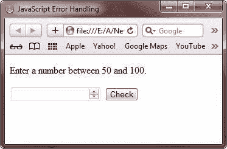

# JavaScript 错误处理

> 原文：<https://codescracker.com/js/js-error-handling.htm>

在执行您的 JavaScript 代码时会出现许多错误。因此，你必须知道如何处理错误。

JavaScript 中的错误处理可以用 [JavaScript try-catch](/js/js-errors.htm) 语句进行。

## JavaScript 错误处理示例

下面是 JavaScript 中错误处理的一个例子:

```
<!DOCTYPE html>
<html>
<head>
   <title>JavaScript Error Handling</title>
</head>
<body>

<p>Enter a number between 50 and 100.</p>

<input id="demoinp" type="number" min="50" max="100" step="1">
<button type="button" onclick="myerrhandle()">Check</button>
<p id="errormessage"></p>

<script>
   function myerrhandle()
   {
      var message, x;
      message = document.getElementById("errormessage");
      message.innerHTML = "";
      x = document.getElementById("demoinp").value;
      try
      { 
         if(x == "")
            throw "empty";
         if(isNaN(x))
            throw "not a number";
         x == Number(x);
         if(x>50 && x<100)
            throw "OK!";
         if(x < 50)
            throw "less than 50";
         if(x > 100)
            throw "greater than 100";
      }
      catch(err)
      {
         message.innerHTML = "The Input is " + err;
      }
}
</script>

</body>
</html>
```

下面是上面的 JavaScript 错误处理示例代码产生的示例输出。这是最初的输出:



现在，输入一个数字并按下 **Check** 按钮，产生如下图所示的输出:


下面是上述 JavaScript 错误处理程序的另一个运行示例:


下面是另一个运行示例:


下面是上述 JavaScript 错误处理示例程序的实时演示输出。输入任意数字，按下**检查**按钮 检查输出:

请输入一个介于 50 和 100 之间的数字。

<input id="demoinp" type="number" min="50" max="100" step="1"> <button type="button" onclick="myerrhandle()">Check</button>

[JavaScript 在线测试](/exam/showtest.php?subid=6)

* * *

* * *