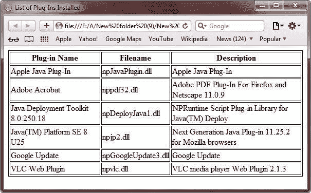
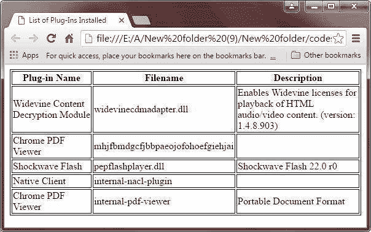
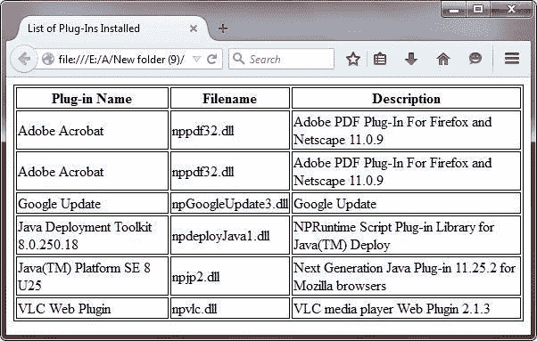

# JavaScript 多媒体

> 原文：<https://codescracker.com/js/js-multimedia.htm>

JavaScript navigator 对象包括被称为插件的子对象。这个对象基本上是一个[数组](/js/js-arrays.htm)、 ，浏览器中安装的每个插件都有一个条目。

## JavaScript 多媒体示例

下面是一个例子，列出了您的浏览器中安装的所有插件:

```
<html>
<head>
<title>List of Plug-Ins Installed</title>
<style>
   table,th,td{border:1px solid black;}
</style>
</head>
<body>

<table>
<tr>
    <th>Plug-in Name</th>
    <th>Filename</th>
    <th>Description</th>
</tr>
<script language="JavaScript" type="text/javascript">
   for (i=0; i<navigator.plugins.length; i++)
   {
      document.write("<tr><td>");
      document.write(navigator.plugins[i].name);
      document.write("</td><td>");
      document.write(navigator.plugins[i].filename);
      document.write("</td><td>");
      document.write(navigator.plugins[i].description);
      document.write("</td></tr>");
   }
</script>
</table>

</body>
</html>
```

下面是上面的 JavaScript 多媒体示例代码产生的输出。这是在 **Safari** 浏览器中生成的输出:



这是在**谷歌 Chrome** 浏览器中生成的输出:



这是在 **Mozilla Firefox** 浏览器中生成的输出:



这是在您当前使用的浏览器中生成的实时演示输出。上面的 JavaScript 多媒体示例代码将显示以下结果(安装的所有插件及其名称、文件名和描述):

| 插件名称 | 文件名 | 描述 |

[JavaScript 在线测试](/exam/showtest.php?subid=6)

* * *

* * *