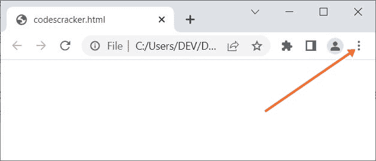
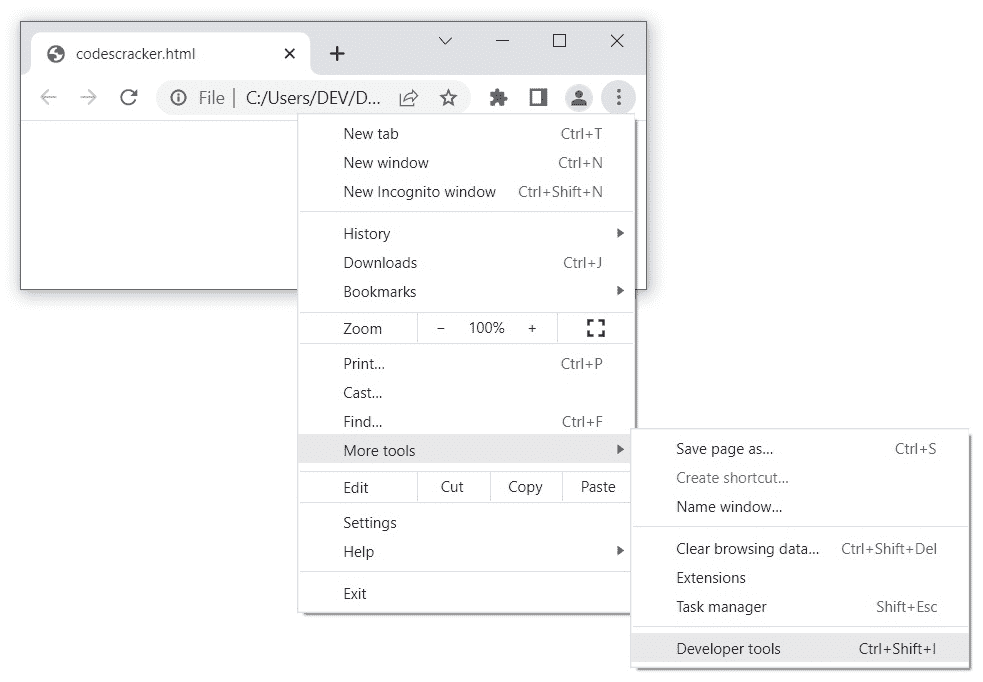
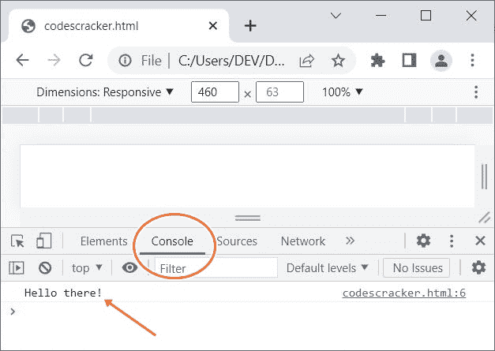

# JavaScript console.log()

> 原文：<https://codescracker.com/js/js-console-log.htm>

JavaScript **console.log()** 方法用于将数据/消息写入 web 控制台。例如:

```
<!DOCTYPE html>
<html>
<body>

   <script>
      console.log("Hello there!");
   </script>

</body>
</html>
```

要查看输出，或者按下 **F12** 功能键，然后导航到**控制台**。或者点击 浏览器窗口右上方的 三个竖线点(Google Chrome)或三条竖线(Mozilla Firefox)，如下图所示:



然后导航到**更多工具**->-**开发者工具**，如下图所示:



一个新的界面将在同一窗口中打开。现在点击**控制台**查看输出，如下面给出的最终快照中的 所示:



## JavaScript console.log()语法

JavaScript 中 **console.log()** 方法的语法是:

```
console.log(message)
```

**消息**参数是必需的，用于在控制台上显示日志消息。

**注意-** 如果你注意到了，在**开发者工具**部分下有**控制台**。这就是为什么， developer 使用 **console.log()** 作为他们的测试或调试工具。

[JavaScript 在线测试](/exam/showtest.php?subid=6)

* * *

* * *