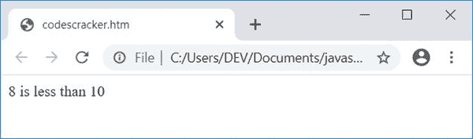

# JavaScript 编程示例

> 原文：<https://codescracker.com/js/program/index.htm>

现在，JavaScript 是世界上最受欢迎的编程语言。JavaScript 也是最流行和最广泛使用的 编程语言。

JavaScript 是 Web 编程的一种**语言。所以要在网络上编程，JavaScript 是必不可少的。**

因此，我们提供了大量的 JavaScript 程序来练习和学习。每个 JavaScript 程序都有静态和动态输出。

静态输出是执行程序时通过图形表示显示的输出。也就是说，在测试和执行的时候，每一个输出的快照都在这里提供，以消除您对任何 JavaScript 程序的疑虑。

而动态输出意味着，每个节目的现场输出也被提供。实时输出意味着，你也可以用你的输入来检查程序。过一会儿，你就会明白我想说的话。

**注意-** 这里，静态和动态输出与技术词汇无关，只是提醒一下，在 这一系列的 JavaScript 程序中，这两种输出是怎样的。

**Note -** Here, each and every JavaScript program is well tested.

有太多的程序是通过 JavaScript 创建的。所以不可能在一篇文章中附上所有的程序，所以我们创建了 JavaScript 程序系列文章。

每个 JavaScript 程序最初都是用非常简单的代码创建的，所以初学者也可以理解这里所有可用的程序。在初学者的简单代码之后，在每一个主题中都给出了一点复杂的代码。

## 面向初学者的 JavaScript 程序

在每一个 JavaScript 程序中，我们都提供了最简单的 JavaScript 代码来完成这项任务。这样，一个初学 JavaScript 的人也能理解这个主题。随后，还接收来自用户的输入，并基于用户输入执行计算。

例如，如果用户想学习如何用 JavaScript 将两个数字[相加，那么 一个简单的 JavaScript 代码如下:](/js/program/javascript-add-two-numbers.htm)

```
var a=3, b=7, sum;
sum = a+b;
```

在接收用户输入并打印结果的实际程序和所有这些类型的程序之前给出。

在上面的 JavaScript 两行代码中，第一行声明了三个变量， **a** 、 **b** 和 **sum** 。值 **3** 和 7 已经初始化为前两个变量。而在第二行，值， **a+b** 或 **3+7** 或 **10** 将 初始化为**和**。

#### 热门 JavaScript 程序

以下是 JavaScript 中一些流行程序的列表:

*   [加两个数](/js/program/javascript-add-two-numbers.htm)
*   [加、减、乘、除](/js/program/javascript-add-subtract-multiply-divide.htm)
*   [检查偶数或奇数](/js/program/javascript-check-even-odd.htm)
*   [将 n 个数字相加](/js/program/javascript-add-n-numbers.htm)
*   [添加数字的位数](/js/program/javascript-add-digits-of-number.htm)

## 带输出的 JavaScript 程序示例

本系列中编写的每一个 JavaScript 程序都经过了输出测试。例如，让我们看看下面的 JavaScript 程序，检查数字是否小于 10:

```
var num=12;
if(num<10)
  document.write(num + " is less than 10");
else
  document.write(num + " is not less than 10");
```

这是最简单的 JavaScript 代码，向初学者展示了如何在每篇文章中创建最简单的 JavaScript 代码。这是用 HTML 编写的同一个 JavaScript 程序:

```
<!doctype html>
<html>
<head>
<script>
var num=12;
if(num<10)
  document.write(num + " is less than 10");
else
  document.write(num + " is not less than 10");
</script>
</head>
<body>

</body>
</html>
```

用**将上述代码保存在一个文件中。html** 扩展说【codescracker.html】T2。现在在 web 浏览器中打开这个文件。这里是 你将看到的输出。对于这一系列 JavaScript 程序来说，这就是静态输出的含义:


现在用 **8** 改变 **num** 的值，并将代码保存在同一文件中。因此刷新网页浏览器后，这里是 这次你将看到的输出:



**注意-****document . write()**方法将大括号 **()** 中的数据写入 HTML 输出。

最后，这是接收用户输入的实际程序，然后 JavaScript 代码根据用户输入开始运行:

```
<!doctype html>
<html>
<head>
<script>
function jsFun()
{
  var val, elem;
  val = parseInt(document.getElementById("num").value);
  if(val)
  {
    if(val<10)
      document.getElementById("paraTwo").innerHTML = "Less than 10";
    else
      document.getElementById("paraTwo").innerHTML = "Greater than 10";
  }
}
</script>
</head>
<body>

<p id="paraOne">Enter a Number: <input id="num">
<button onclick="jsFun()">Enter</button></p>
<p id="paraTwo"></p>

</body>
</html>
```

下面是它的示例输出:


现在输入一个数字，比如说 **19** 并点击**输入**按钮以查看以下输出:


#### 先前 JavaScript 程序的实时输出

这是实时输出。这就是动态输出对于这一系列 JavaScript 程序的意义:

输入一个数字:<input id="num"> <button onclick="jsFun()">输入</button>

当用户点击按钮**进入**时，一个名为 **jsFun()** 的函数被调用。这个函数的所有语句都被执行。也就是说，两个变量 **val** 和 **elem** 被声明，语句:

```
val = parseInt(document.getElementById("num").value);
```

声明，id 为 **num** 的 HTML 元素的 **int** (整数)值被初始化为 **val** 变量。现在 代码
`if(val)`检查 **val** 是否有值或者为空。创建该代码是为了检查用户 是否输入了一些数据，然后点击了**输入**按钮，或者在没有提供输入的情况下点击了**输入**按钮。

现在，如果用户输入数字，比如说 **19** ，那么 **val=19** 。现在使用 **if** ，我们检查了 **val** (19)的值是否小于 10。因为条件 **val < 10** 或 **19 < 10** 评估为假，所以程序流不 进入 **if** 体，而是进入其 **else** 部分，语句:

```
document.getElementById("paraTwo").innerHTML = "Greater than 10";
```

得到执行，它声明，一个 id 为 **paraTwo** 的 HTML 元素的值被打印为**大于 10** 。

**注意-** 从下一篇文章(章节)开始，你将学习 JavaScript 程序的每一个代码块

[JavaScript 在线测试](/exam/showtest.php?subid=6)

* * *

* * *