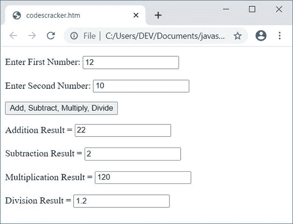

# JavaScript 程序：加，减，乘，除

> 原文：<https://codescracker.com/js/program/javascript-add-subtract-multiply-divide.htm>

在本文中，您将学习并获得在 JavaScript 语言中应用加减乘除的代码。这里有两个程序可以用来执行 JavaScript 中这四个著名的数学运算:

*   无需用户输入即可在 JavaScript 中进行加减乘除运算
*   允许用户使用文本框输入数字

## JavaScript 中的加、减、乘、除

下面的 JavaScript 程序查找并打印两个数的加、减、乘、除结果，比如说 **12** 和 **10** ，而不需要用户输入。

这只是一个演示程序，说明如何使用 JavaScript 代码执行这四个数学运算。随后，同样任务的另一个程序也被给出，它接收来自用户的输入。

```
<!doctype html>
<html>
<body>
<script>
  var numOne=12, numTwo=10, res;
  res = numOne + numTwo;
  document.write("Add = " + res + "<br/>");
  res = numOne - numTwo;
  document.write("Subtract = " + res + "<br/>");
  res = numOne * numTwo;
  document.write("Multiply = " + res + "<br/>");
  res = numOne/numTwo;
  document.write("Divide = " + res + "<br/>");
</script>
</body>
</html>
```

用**将这段代码保存在一个文件中。html** 扩展名。在 web 浏览器中打开文件。以下是上述代码产生的输出:


### 允许用户使用文本框输入数字

现在这个程序允许用户输入两个数，然后对给定的两个数进行加、减、乘、除运算。

```
<!doctype html>
<html>
<head>
<script>
var numOne, numTwo, res, temp;
function fun()
{
  numOne = parseInt(document.getElementById("one").value);
  numTwo = parseInt(document.getElementById("two").value);
  if(numOne && numTwo)
  {
    temp = document.getElementById("res");
    temp.style.display = "block";
    res = numOne + numTwo;
    document.getElementById("add").value = res;
    res = numOne - numTwo;
    document.getElementById("subtract").value = res;
    res = numOne * numTwo;
    document.getElementById("multiply").value = res;
    res = numOne / numTwo;
    document.getElementById("divide").value = res;
  }
}
</script>
</head>
<body>

<p id="input">Enter First Number: <input id="one">
<br/><br/>
Enter Second Number: <input id="two"></p>
<p><button onclick="fun()">Add, Subtract, Multiply, Divide</button></p>
<p id="res" style="display:none;">
Addition Result = <input id="add"><br/><br/>
Subtraction Result = <input id="subtract"><br/><br/>
Multiplication Result = <input id="multiply"><br/><br/>
Division Result = <input id="divide"></p>

</body>
</html>
```

下面是它的输出:


现在用任意两个数字填满两个盒子，比如说 **12** 和 **10** 。现在点击按钮，**加、减、乘、 除**，显示两个输入数字的加、减、乘、除，如下图所示。 这是最终输出:



以下 CSS 代码:

```
style="display:none;"
```

隐藏 HTML 元素。因为它包含在 id 为 **res** 的段落中。所以最初这一段会被隐藏。

当用户点击按钮时，**加、减、乘、除**，然后一个名为 **fun()** 的函数被调用。这个函数中所有的 语句都会被执行。

以下 JavaScript 语句:

```
numOne = parseInt(document.getElementById("one").value);
```

声明，id 为 **one** 的 HTML 元素的 **int** (整数)值被初始化为 **numOne** 变量。和 下面的 JavaScript 语句:

```
temp.style.display = "block";
```

声明，在执行上述 JavaScript 语句后，id 存储在 **temp** 变量中的 HTML 元素变得可见。 下面是另一个 JavaScript 语句:

```
document.getElementById("add").value = res;
```

其中声明，在一个 id 为 **add** 的 HTML 元素中打印出 **res** 的值。

#### 上一个节目的实时输出

以下是之前的 JavaScript 程序在加减乘除运算时产生的实时输出:

输入第一个数字:<input id="one">

输入第二个数字:<input id="two">

<button onclick="fun()">加、减、乘、除</button>

加法结果= <input id="add">

减法结果= <input id="subtract">

乘法结果= <input id="multiply">

除法结果= <input id="divide">

[JavaScript 在线测试](/exam/showtest.php?subid=6)

* * *

* * *