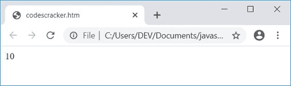

# JavaScript 程序：添加数字

> 原文：<https://codescracker.com/js/program/javascript-add-digits-of-number.htm>

在本文中，您将学习并获得用 JavaScript 添加数字的代码。以下是 JavaScript 程序列表，您将浏览:

*   无需用户输入，在 JavaScript 中添加数字
*   允许用户输入号码。给出了该程序的现场输出

## 在 JavaScript 中添加数字

这个程序不允许用户输入数据。也就是说，这个程序只将一个数的所有数字相加，比如说 **1234** ，并在输出上打印其加法结果。

这只是一个简单的 JavaScript 代码，它提醒你，一个数的所有数字的加法是如何执行的

```
<!doctype html>
<html>
<body>
<script>
  var num=1234, rem, sum=0;
  while(num)
  {
    rem = num%10;
    sum = sum+rem;
    num = Math.floor(num/10);
  }
  document.write(sum);
</script>
</body>
</html>
```

用**将这段代码保存在一个文件中。html** 扩展名，并在 web 浏览器中打开它。以下是输出:



**注意**—**math . floor()**方法将数字四舍五入到最接近的整数。也就是 **Math.floor(12/10)** 给你 **1** ，而不是 **1.2**

以下代码:

```
while(num)
{
  rem = num%10;
  sum = sum+rem;
  num = Math.floor(num/10);
}
```

工作方式是:

*`while`循环的条件*评估为真，因为最初 **num** 的值不为 0*
*   所以程序流程进入了循环
*   在那里 **num%10** 或 **1234%10** 或 **4** 被初始化为 **rem** 。所以 **rem=4**
*   并且 **sum+rem** 或 **0+4** 或 **4** 被初始化为 **sum** 。所以 **sum=4**
*   最后一个语句， **Math.floor(num/10)** 或 **Math.floor(1234/10)** 或 **Math.floor(123.4)** 或 **123** 被初始化为 **num**
*   现在再次评估循环中*的条件。因为 **num** 的值是**123**T8】不等于 **0** ，因此条件再次评估为真*
*   所以程序流再次进入循环，并对所有三条语句求值
*   这个过程一直持续到循环的条件*评估为假*

方法将 **sum** 的值写入一个 HTML 输出。

### 从用户处获取输入

该程序允许用户输入数字，然后查找并打印输入(给定)数字的总和，如下所示:

```
<!doctype html>
<html>
<head>
<script>
function addDigitsOfNumber()
{
  var num, rem, sum=0;
  num = parseInt(document.getElementById("num").value);
  while(num)
  {
    rem = num%10;
    sum = sum+rem;
    num = Math.floor(num/10);
  }
  document.getElementById("result").value = sum;
}
</script>
</head>
<body>

<p>Enter the Number: <input id="num"></p>
<button onclick="addDigitsOfNumber()">Add Digits Of Number</button>
<p>Result = <input id="result"></p>

</body>
</html>
```

下面是用户输入的示例输出， **1234** :


#### 上一个节目的实时输出

下面是上面的 JavaScript 程序在用户添加给定数字时的实时输出:

输入号码:<input id="num">

<button onclick="addDigitsOfNumber()">Add Digits Of Number</button>

结果= <input id="result">

点击按钮**添加数字**后，调用函数 **addDigitsOfNumber()** 。因此，该函数中的所有 语句都被执行，id 为**结果**的输入的值随着**总和**的值而改变。

[JavaScript 在线测试](/exam/showtest.php?subid=6)

* * *

* * *