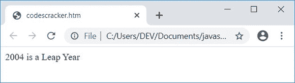
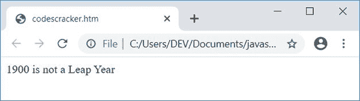
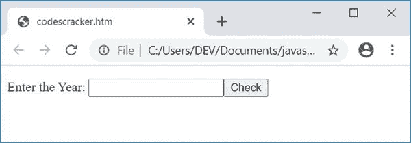
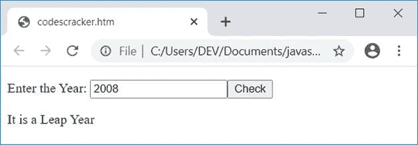

# 检查闰年的 JavaScript 程序

> 原文：<https://codescracker.com/js/program/javascript-check-leap-year.htm>

在本文中，您将学习并获得用 JavaScript 检查一年是否是闰年的代码。以下是可用的 JavaScript 程序列表:

*   检查闰年与否。这个程序不允许用户输入数据
*   检查用户给定的年份是否是闰年。这个程序允许用户使用 HTML 文本框输入数据(年份)

### 闰年怎么查？

一年被称为闰年，当

*   要么是被 4 除，而不是被 100 除
*   或者除以 400

如果你好奇想了解，这个公式是如何得出闰年的，可以参考[闰年公式解释](/nonprog/leap-year.htm) 来得到每一个关于闰年所需的东西。

## 在 JavaScript 中检查闰年与否

这是检查闰年与否的最简单的 JavaScript 程序。也就是说，这个程序不允许用户输入年份。

```
<!doctype html>
<html>
<head>
<script>
var yr=2004;
if((yr%4==0) && (yr%100!=0))
  document.write(yr + " is a Leap Year");
else if(yr%400==0)
  document.write(yr + " is a Leap Year");
else
  document.write(yr + " is not a Leap Year");
</script>
</head>
<body>

</body>
</html>
```

用**将这段代码保存在一个文件中。html** 扩展名。在 web 浏览器中打开文件。以下是输出:



现在用 **1900** 改变 **yr** 变量的值并再次打开文件，或者刷新网络浏览器的窗口。下面是您将看到的 输出:



函数 **document.write()** 将数据(在括号内)写入 HTML 输出。

### 接收用户输入的年份

这个程序使用 HTML 文本框接收用户输入的年份。也就是说，这个程序要求用户输入年份，然后检查并打印是否是闰年。

```
<!doctype html>
<html>
<head>
<script>
var yr, temp;
function fun()
{
  yr = parseInt(document.getElementById("year").value);
  if(yr)
  {
    temp = document.getElementById("resPara");
    temp.style.display = "block";
    if((yr%4==0) && (yr%100!=0))
      document.getElementById("res").innerHTML = "a Leap";
    else if(yr%400==0)
      document.getElementById("res").innerHTML = "a Leap";
    else
      document.getElementById("res").innerHTML = "not a Leap";
  }
}
</script>
</head>
<body>

<p>Enter the Year: <input id="year"><button onclick="fun()">Check</button></p>
<p id="resPara" style="display:none;">It is <span id="res"></span> Year</p>

</body>
</html>
```

下面是它的示例输出:



现在输入 2008 年的**，点击**按钮，检查**。以下是您将看到的输出:**

**

以下代码:

```
style="display:none;"
```

是一个 CSS 代码，它声明，一个 HTML 元素被隐藏，在它被写的地方。因为它被写在一个 id 为 **resPara** 的 **p** (段落) 标签中，所以这个段落最初被隐藏。

当用户点击按钮 **Check** 时，一个 JavaScript 函数 **fun()** 被调用。这个函数 的所有语句都会被执行。

以下 JavaScript 语句:

```
yr = parseInt(document.getElementById("year").value);
```

声明 id 为**年**的 HTML 元素的 **int** (整数)值被初始化为**年**。以及下面的 JavaScript 语句:

```
temp.style.display = "block";
```

声明，一个 HTML 元素，其 id 存储在 **temp** 变量中，在执行这段代码后变得可见。这里是另一个 JavaScript 语句:

```
document.getElementById("res").innerHTML = "a Leap";
```

这表明，字符串值，**Leap**被写入一个 HTML 元素的输出，该元素的 id 是 **res** 。

#### 上一个节目的实时输出

下面是前一个程序的实时输出，用 JavaScript 检查用户给出的年份是否是闰年:

输入年份:<input id="year"> <button onclick="fun()">勾选</button>

今年是年

[JavaScript 在线测试](/exam/showtest.php?subid=6)

* * *

* * ***