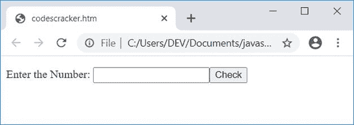

# JavaScript 程序：检查质数

> 原文：<https://codescracker.com/js/program/javascript-check-prime-number.htm>

在本文中，您将学习并获得在 JavaScript 中检查用户输入的数字是否是质数的代码。以下是您将经历的项目列表:

*   检查质数与否。这个程序不允许用户输入数据
*   检查用户输入的数字是否是质数。这个程序允许用户输入数字

### 什么是质数？

质数是只能被 1 和数本身整除的数。例如 2、3、5、7、13、17 等等。

你可以清楚地看到，17 这个数字只能被 1 和 17 整除。同样，13 只能被 1 和 13 除。

## 在 JavaScript 中检查质数

下面是一个最简单的 JavaScript 程序，用来检查一个数是否是质数。这个程序不接受用户的输入。

```
<!doctype html>
<html>
<body>
<script>
var num, i, chk=0;
num=19;
for(i=2; i<num; i++)
{
  if(num%2==0)
  {
    chk++;
    break;
  }
}
if(chk==0)
  document.write(num + " is a Prime Number");
else
  document.write(num + " is not a Prime Number");
</script>
</body>
</html>
```

用**将这段代码保存在一个文件中。html** 扩展名。在 web 浏览器中打开文件。下面是生成的输出:


现在用 **20** 改变 **num** 的值。即初始化 **20** 到 **num** 。保存代码并 再次打开，或者刷新浏览器。以下是您将看到的输出:


**注意-****document . write()**方法将数据写入 HTML 输出。

### 获取用户输入的数字

这是另一个程序，要求用户输入数字，检查并打印用户输入的数字是否是质数。

```
<!doctype html>
<html>
<head>
<script>
var num, i, chk, temp;
function checkPrime()
{
  num = parseInt(document.getElementById("num").value);
  if(num)
  {
    chk=0;
    temp = document.getElementById("resPara");
    temp.style.display = "block";
    for(i=2; i<num; i++)
    {
      if(num%2==0)
      {
        chk++;
        break;
      }
    }
    if(chk==0)
      document.getElementById("res").innerHTML = "a Prime";
    else
      document.getElementById("res").innerHTML = "not a Prime";
  }
}
</script>
</head>
<body>

<p>Enter the Number: <input id="num"><button onclick="checkPrime()">Check</button></p>
<p id="resPara" style="display:none;">It is <span id="res"></span> Number</p>

</body>
</html>
```

下面是它的示例输出:



现在提供任意一个数字，比如说 **37** ，点击**检查**按钮，检查并打印一条信息，告知它是否是质数 ，如下图所示:


以下代码:

```
style="display:none;"
```

是一个 CSS 代码，隐藏 HTML 元素。因为它出现在一个 id 为 **resPara** ， 的 **p** (段落)标签中，因此该段落最初被隐藏

当用户点击按钮 **Check** 时，一个名为 **checkPrime()** 的函数被调用。以下 JavaScript 代码:

```
num = parseInt(document.getElementById("num").value);
```

声明，一个 id 为 **num** 的 HTML 元素的 **int** (整数)值被初始化为 **num** 变量。如果 **num** 持有任何值(而不是空的或空的)，如果， **num** 的条件评估为真，因此程序 流程进入循环内部。

以下 JavaScript 代码/语句:

```
temp.style.display = "block";
```

声明，一个 HTML 元素，其 id 存储在 **temp** 变量中，在执行这段代码后变得可见。和下面的代码:

```
document.getElementById("res").innerHTML = "a Prime";
```

声明字符串值**一个质数**被写入一个 HTML 元素，该元素的 id 是 **res**

#### 上一个节目的实时输出

这是前面的 JavaScript 程序的实时输出，它要求用户输入一个数字，并检查它是否是一个质数。

输入号码:<input id="num"> <button onclick="checkPrime()">勾选</button>

是号

[JavaScript 在线测试](/exam/showtest.php?subid=6)

* * *

* * *