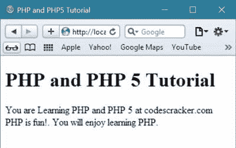
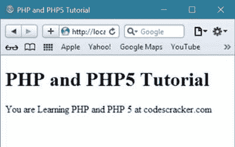

# PHP 教程

> 原文：<https://codescracker.com/php/index.htm>

本教程将教你所有关于 PHP 和 PHP 5 的知识，从初级到高级。

## PHP 是什么？

PHP 是一种脚本语言，支持[面向对象的](/php/php-object-oriented.htm)特性。 PHP 用于创建动态[网页](/networking/web-sites-addresses-pages.htm)或网络应用。

PHP 可以部署在[数组](/php/php-arrays.htm) [Web 服务器](/networking/web-browser-server.htm)、[操作系统](/operating-system/index.htm) 或平台(如 Windows、Unix、Linux 等)上。PHP 还支持各种 数据库(比如 Oracle、MySQL、Informix 和 Sybase)。

您可以通过在 HTML(超文本标记语言)页面中嵌入 PHP 脚本来使用 PHP。您可以将 PHP 和 AJAX 集成在一起，创建在最新版本的浏览器上运行速度极快的 Web 应用程序。

## 什么是 PHP 文件？

PHP 文件可以由 HTML、CSS、JavaScript 和 PHP 代码组成。

## PHP 文件扩展名

您可以使用以下扩展名之一保存 PHP 文件:

*   。PHP
*   . php3
*   phtml
*   . ph3
*   . ph4
*   . php5
*   . ph5

## PHP 的特点

以下是 PHP 的特点:

*   PHP 很简单
*   PHP 很安全
*   PHP 是高效的
*   PHP 是灵活的
*   PHP 很熟悉

## PHP 之前学什么？

在开始学习 PHP 之前，你必须对 [HTML](/html/index.htm) 、 [CSS](/css/index.htm) 、 JavaScript 有基本的了解。

## PHP 能做什么？

PHP 可以完成很多任务，如输出图像、文件等。PHP 还帮助[将文件](/php/php-file-uploading.htm)上传到服务器。

## 为什么要学 PHP？

程序员喜欢 PHP 的原因如下:

*   在各种平台上运行
*   支持广泛的数据库
*   与几乎所有服务器兼容
*   在服务器端高效运行

下面是一个简单的 PHP 示例:

```
<!DOCTYPE html>
<html>
<head>
   <title>PHP and PHP5 Tutorial</title>
</head>
<body>

<?php
   echo "<h1>PHP and PHP 5 Tutorial</h1>";
   echo "You are Learning PHP and PHP 5 at codescracker.com<br>";
   echo "PHP is fun!. You will enjoy learning PHP.<br>";
?> 

</body>
</html>
```

要知道如何保存和运行上面的 PHP 例子，参考 [PHP 环境设置](/php/php-environment-setup.htm)来一步步了解如何在你的电脑 系统中实现 PHP。

用**保存上述文件。php** 扩展名，并在浏览器中打开它，网页看起来会像:



下面是另一个 PHP 示例:

```
<!DOCTYPE html>
<html>
<head>
   <title>PHP and PHP5 Tutorial</title>
</head>
<body>

<?php
   $str1 = "PHP and PHP5 Tutorial";
   $str2 = "codescracker.com";

   echo "<h1>$str1</h1>";
   echo "You are Learning PHP and PHP 5 at $str2";
?>

</body>
</html>
```

以下是这个 PHP 示例的输出:



在这一系列教程中，你将一个接一个地学习 PHP 和 PHP 5。

## 观众

这个 PHP 教程系列是由专业的 PHP 程序员设计和开发的，它将通过教程和代码帮助所有有兴趣练习和学习 PHP 的 PHP 爱好者。

在这里，我们在每一章都包含了大量的 PHP 代码，并给出了输出和解释。

因此，你可以通过这篇 PHP 教程来深入了解 PHP。

## 先决条件

在开始学习 PHP 之前，你必须先了解一些基本的计算机技能和 HTML。

如果你对如何编程有一些先验知识，那么学习 PHP 就变得太容易了。

[PHP 在线测试](/exam/showtest.php?subid=8)

* * *

* * *