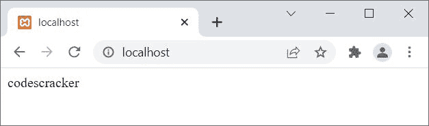

# PHP 打印语句

> 原文：<https://codescracker.com/php/php-print.htm>

PHP **print** 语句用于在屏幕或 web 上输出一些数据。例如:

```
<?php
   print "PHP is Fun!";
?>
```

上述 PHP 示例的输出是:


同样的(前一个)例子也可以这样创建:

```
<?php
   $x = "PHP is Fun!";
   print $x;
?>
```

让我以另一种方式创建相同的示例:

```
<?php
   $x = "PHP is Fun!";
   print($x);
?>
```

它产生的输出与前面的例子完全一样，因为 **($x)** 被评估为**(“PHP 很有趣！”)**、 哪个是有效表达式。

**注意-** 但是让我告诉你一件事，<u>只在你需要优先 一个表达式先执行的时候才使用括号</u>。例如:

```
<?php
   print(1+3) * 12;
?>
```

上述 PHP 示例的输出是:


在上面的例子中，如果你去掉括号，那么输出应该是 **37** 。这就是我们需要使用括号的情况 。否则，**打印**不需要任何括号来输出屏幕上的 数据。

## PHP 打印语句示例

```
<?php
   $x = 24;
   print $x;
   print "<hr>";

   $x = 18.93;
   print $x;
   print "<hr>";

   $x = "Hey!";
   print $x;
   print "<hr>";

   $x = "Hey,<br>is everything OK?";
   print $x;
?>
```

上述 PHP 示例的输出是:


**注-** 用[回声](/php/php-echo.htm)代替**打印**在屏幕上输出数据。 但是由于 **print** 语句总是返回 1，因此需要时使用 **print** 作为 表达式执行。例如:

```
<?php
   $x = '';
   print print $x;
?>
```

这个例子将产生 **1** 。让我根据这个场景创建另一个示例:

```
<?php
   $x = 'hello';
   print print $x;
?>
```

上述 PHP 示例的输出是:


现在是时候创建最后一个关于 **print** 语句或关键字的例子来完成关于 it 的教程:

```
<?php
   if(print "codes")
   {
      echo "cracker";
   }
?>
```

上述 PHP 示例的输出是:



[PHP 在线测试](/exam/showtest.php?subid=8)

* * *

* * *