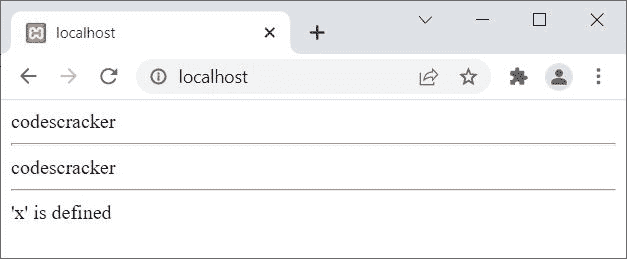

# PHP 中 echo 和 print 的区别

> 原文：<https://codescracker.com/php/php-echo-print.htm>

本文旨在区分两个著名的关键词或陈述，即:

*   [回显](/php/php-echo.htm)语句
*   [打印](/php/php-print.htm)报表

## PHP echo Vs print

| 回声 | 打印 |
| 接受多个参数 | 只接受一个参数 |
| 不返回任何值 | 总是返回 1 |
| 不能用作表达式 | 可以用作一个表达式 |
| 比**打印**快一点 | 比**回声**稍慢 |

## PHP 回显与打印示例

```
<?php
   print "codescracker";
   echo "<hr>";
   echo "codes", "cracker";
   echo "<hr>";
   $x = 120;
   $x ? print "'x' is defined" : print "'x' is not defined";
?>
```

上述 PHP 示例的输出是:



有关这两个语句中任何一个或两个语句的详细信息，请参考单独的教程。

[PHP 在线测试](/exam/showtest.php?subid=8)

* * *

* * *