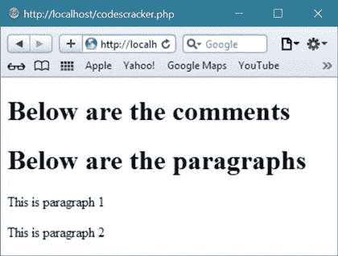
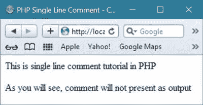
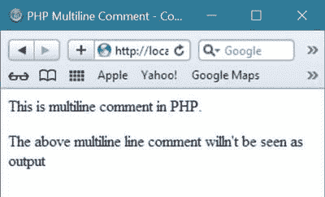

# PHP 注释

> 原文：<https://codescracker.com/php/php-comments.htm>

注释不会作为 [PHP](/php/index.htm) 脚本的一部分被读取或执行。注释有助于 稍后提醒代码。

你可以用注释来描述你的 PHP 脚本。注释还有助于以后调试 PHP 脚本。

## PHP 注释示例

下面是一个小的 PHP 脚本，包含了 PHP 中上述三种注释方式:

```
<!DOCTYPE html>
<html>
<body>

<?php
   echo "<h1>Below are the comments</h1>";
   // This is a single-line comment
   # This is also a single-line comment
   /*
      This is a multiple-line comment block,
      can span over multiple
      lines as required
   */
   // You can also use comments to leave out parts of a code line
   echo "<h1>Below are the paragraphs</h1>";
   echo "<p>This is paragraph 1</p>";
   echo "<p>This is paragraph 2</p>";
?>

</body>
</html>
```

由于注释没有被运行/执行，所以会产生以下结果:



## PHP 中的注释类型

PHP 中基本上有两种类型注释:

*   单行注释
*   多行注释

或者你可以说 PHP 脚本中总共有三种注释方式，分别是:

*   **//这里是注释**——这是单行注释
*   **# comments 到这里** -这也是单行注释
*   **/*注释在这里*/** -这是一个多行注释

## PHP 中的单行注释

PHP 中的单行注释以//或#开头。下面的例子展示了如何在两种方式中包含单行注释。

```
<html>
<head>
   <title>PHP Single Line Comment - CodesCracker</title>
</head>
<body>
<?php 
   // this is first way of single line comment in PHP
   # and this is second way of single line comment in PHP 
   echo "<p>This is single line comment tutorial in PHP</p>";
   echo "<p>As you will see, comment will not present as output</p>";
?>
</body>
</html>
```

以下是上述 PHP 单行注释示例的输出示例:



从上面的输出可以看出，在 PHP 程序中作为注释出现的文本没有出现在输出中。现在我们来谈谈 PHP 中的多行注释。

## PHP 中的多行注释

多行注释可以包含在/*中....*/

在四个点的地方，也就是说，....，您可以在 PHP 程序中放置多行注释。让我们举一个例子来说明如何在任何 PHP 脚本中编写多行注释。

```
<html>
<head>
   <title>PHP Multiline Comment - CodesCracker</title>
</head>
<body>
<?php 
   /*
      This is multiline comment tutorial in PHP 
      You can include comment expanding as much line 
      as possible, it totally depends on you.
      You can use multiline comment in place of single
      line comment when you required to write some comment 
      that will be expanding in more than one line.
      Multiline line comment is useful when you want to
      write some detail description of your PHP code.
   */ 
   echo "<p>This is multiline comment in PHP.</p>";
   echo "<p>The above multiline line comment willn't be seen as output</p>";
?>
</body>
</html>
```

下面是上面 PHP 多行注释示例代码的运行示例:



[PHP 在线测试](/exam/showtest.php?subid=8)

* * *

* * *