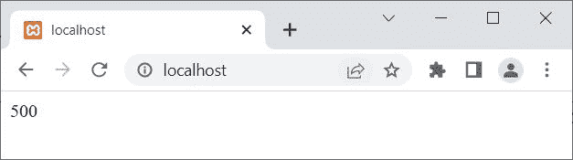
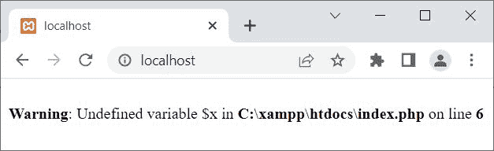
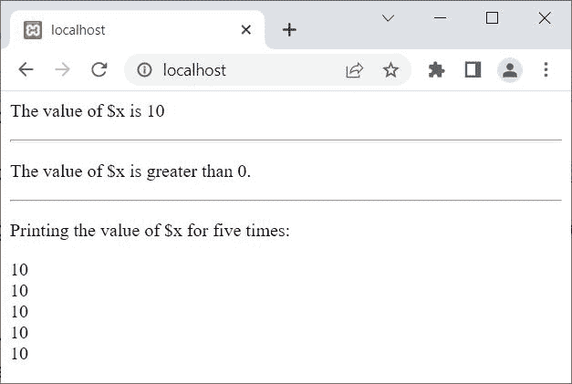
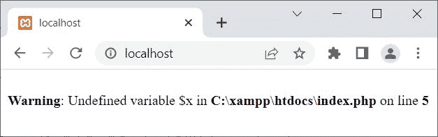
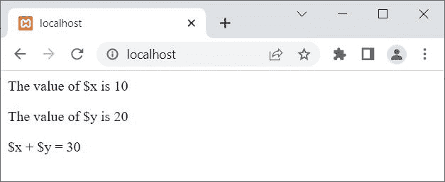
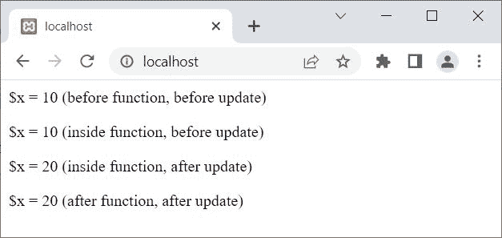
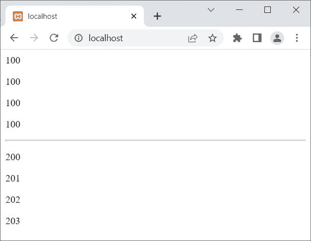
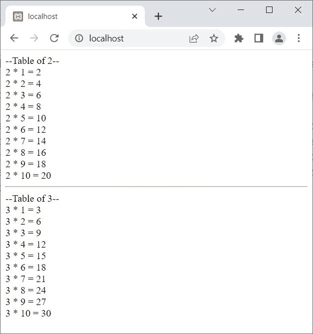

# PHP 变量范围

> 原文：<https://codescracker.com/php/php-variable-scope.htm>

创建这篇文章是为了涵盖 PHP 中变量的作用域这一主题。

变量作用域在 PHP 中是一个重要的话题，因为我们必须知道:

*   定义在函数外部的变量可以在函数内部访问，也可以不在函数内部访问
*   定义在函数内部的变量，是否可以从函数外部访问
*   如果我们需要保留函数中定义的变量的前一个值，该怎么办
*   等等

在开始本教程之前，让我告诉你，PHP 中有以下三个变量范围:

1.  当地的
2.  全球的
3.  静电

## PHP 局部变量

PHP 中的局部变量是那些在函数中定义的变量。而那些变量的作用域只限于那个特定的函数，在它被定义的地方。例如:

```
<?php
   function codescracker()
   {
      $x = 500;
      echo $x;
   }
   codescracker();
?>
```

上面的 PHP 示例产生的输出显示在下面给出的快照中:



在名为 **codescracker()** 的函数中定义的变量 **$x** ，只有在 函数中才能访问。现在的问题是，如果我们试图从定义局部变量 的函数之外访问它，会怎么样？
让我们用下面给出的例子来找出答案:

```
<?php
   function codescracker()
   {
      $x = 500;
   }
   echo $x;
?>
```

这一次，上面的示例产生的输出是:



如果你试图从变量定义的范围之外访问一个局部变量，你会得到类似的输出。

## PHP 全局变量

PHP 中的全局变量是那些在函数外部定义的变量。这些变量的范围是除了函数以外的任何地方。例如:

```
<?php
   $x = 10;

   echo "<p>The value of \$x is $x</p><hr>";

   if($x>0)
      echo "<p>The value of \$x is greater than 0.</p><hr>";

   echo "<p>Printing the value of \$x for five times:</p>";
   for($i=0; $i<5; $i++)
      echo "$x<BR>";
?>
```

上述 PHP 示例的输出是:



现在的问题是，如果我们试图从函数内部访问一个在函数外部声明的变量，会怎么样？
让我们用下面的例子来找出答案:

```
<?php
   $x = 10;
   function codescracker()
   {
      echo $x;
   }
   codescracker();
?>
```

现在，此示例产生的输出是:



当你试图从一个函数内部访问一个在函数外部定义的变量时，你每次都会得到相似的输出。但是 PHP 有一个在函数内部使用全局变量的解决方案。解决方案是，**全局**关键字，就在这一段之后定义。

### PHP 全局关键字

使用 **global** 关键字在函数中声明一个全局变量，以便能够访问该全局 变量，如下所示:

```
function functionName()
{
   global variableName;
}
```

也就是说，在您希望使用 的函数中，使用 **global** 关键字来声明所有的全局变量。例如:

```
<?php
   $x = 10;
   $y = 20;
   function codescracker()
   {
      global $x;
      echo "<p>The value of \$x is $x</p>";
      global $y;
      echo "<p>The value of \$y is $y</p>";

      $z = $x + $y;
      echo "<p>\$x + \$y = $z</p>";
   }
   codescracker();
?>
```

上述 PHP 示例的输出是:



然而，PHP 将所有全局声明的变量存储在一个名为 **$GLOBALS[variable]** 的数组中。 因此，我们可以使用这个数组从函数内部访问和更新一个全局变量。例如:

```
<?php
   $x = 10;
   $y = 20;
   function codescracker()
   {
      echo "<p>The value of \$x is ", $GLOBALS['x'], "</p>";
      echo "<p>The value of \$y is ", $GLOBALS['y'], "</p>";

      $z = $GLOBALS['x'] + $GLOBALS['y'];
      echo "<p>\$x + \$y = $z</p>";
   }
   codescracker();
?>
```

您将获得与上一个示例相同的输出。让我创建另一个例子，我将从函数内部更新全局变量:

```
<?php
   $x = 10;
   echo "<p>\$x = $x (before function, before update)</p>";
   function codescracker()
   {
      echo "<p>\$x = ", $GLOBALS['x'], " (inside function, before update)</p>";
      $GLOBALS['x'] = 20;
      echo "<p>\$x = ", $GLOBALS['x'], " (inside function, after update)</p>";
   }
   codescracker();
   echo "<p>\$x = $x (after function, after update)</p>";
?>
```

这个 PHP 示例的输出是:



## PHP 静态变量

静态变量是那些在函数执行过程中保持其先前值的变量。要创建一个静态变量，我们需要在变量前使用 **static** 关键字使其成为静态的。

PHP **static** 关键字在我们需要多次执行一个函数以保留 或使用它之前的值时出现。通常，变量在函数执行后会被删除。例如:

```
<?php
   function codes()
   {
      $x = 100;
      echo "<p>$x</p>";
      $x++;
   }
   codes();
   codes();
   codes();
   codes();

   echo "<hr>";

   function cracker()
   {
      static $y = 200;
      echo "<p>$y</p>";
      $y++;
   }
   cracker();
   cracker();
   cracker();
   cracker();
?>
```

上述 PHP 静态变量示例的输出显示在下面给出的快照中:



在上面的例子中，第一个函数中的变量 **$x** ，也就是 **codes()** 像往常一样被定义， 因此每次执行完函数后，它的值被打印出来，变量被删除。 但是看看用 **static** 关键字定义的第二个函数中的变量 **$y** ，这使得变量 **$y** 成为一个静态变量。因此，即使在执行该函数之后，它也会保留其先前的值。

下面是 PHP 中静态变量的另一个例子:

```
<?php
   function codescracker()
   {
      static $num = 2;
      echo "--Table of $num--<BR>";
      for($i=1; $i<=10; $i++)
         echo "$num * $i = ", $num*$i, "<BR>";
      $num++;
   }
   codescracker();
   echo "<HR>";
   codescracker();
?>
```

下面给出的快照显示了上面的 PHP 示例产生的示例输出:



[PHP 在线测试](/exam/showtest.php?subid=8)

* * *

* * *