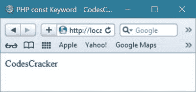

# PHP 常量

> 原文：<https://codescracker.com/php/php-constants.htm>

[PHP](/php/index.htm) 中的常量就像[变量](/php/php-variables.htm)、 一样，但是在常量的情况下，一旦在 PHP 脚本中定义了常量，就不能重新定义/取消定义。

PHP 中有效的常量名称必须以字母或下划线开头(但常量名称前不能有美元符号)。常量在整个 PHP 脚本中是自动全局的:

## 创建一个 PHP 常量

要在 PHP 中创建一个常量，使用名为 define()的函数。下面是 创建 PHP 常量的一般形式:

```
define(name, value, case-insensitive)
```

下面是对创建 PHP 常量时使用的上述参数的解释:

*   **名称** -确定常数的名称
*   **值** -确定常量的值
*   **不区分大小写** -决定常量名是否区分大小写。默认值为 false

## PHP 常量示例

下面是一个示例，创建一个区分大小写的 PHP 常量:

```
<!DOCTYPE html>
<html>
<body>

<?php
   // case-sensitive constant name
   define("GREETING", "Welcome to codescracker.com");
   echo GREETING;
?>

</body>
</html>
```

以下是上述 PHP 脚本的输出:


下面是另一个示例，创建一个名称不区分大小写的常数:

```
<!DOCTYPE html>
<html>
<body>

<?php
   // case-insensitive constant name
   define("GREETING", "Welcome to codescracker.com", true);
   echo greeting;
?>

</body>
</html>
```

这是上面 PHP 脚本的输出:


## PHP 常量关键字

PHP 中的 const 关键字也用于定义 PHP 中的常量。下面的例子展示了如何使用 const 关键字在 PHP 中定义常量。

```
<html>
<head>
   <title>PHP const Keyword - CodesCracker</title>
</head>
<body>
<?php 
   # This example shows how to defined constants 
   # using const keyword or define() function
   # in PHP - CodesCracker
   class clss
   {
      const fullname = "CodesCracker";
      // reference from inside the class using self::
      public function fun()
      {
         return self::fullname;
      }
   }
   // reference from outside the class using
   // the class name followed by ::
   echo clss::fullname;
?>
</body>
</html>
```

下面是上面的 const 关键字示例代码在 PHP 中生成的示例输出:



再举一个 PHP 中 const 关键字定义常量的例子。

```
<html>
<head>
   <title>PHP const Keyword - CodesCracker</title>
</head>
<body>
<h2>PHP const Keyword</h2>
<?php 
   # const keyword example in PHP
   class userLogMsgLevel
   {
      const info = 1;
      const warning = 2;
      const error = 3;
      // you can even assign the constant as a default value
      public function log($notification, $level = self::info)
      {
         echo "Notification level ". $level.": ".$notification;
      }   
   }
   $logObj = new userLogMsgLevel();
   // using default value
   $logObj->log("Info");
   echo "<br/>";
   // using variable
   $logObj->log("Warning", $logObj::warning);
   echo "<br/>";
   // using class
   $logObj->log("Error", userLogMsgLevel::error);
?>
</body>
</html>
```

下面是上面用 PHP 编写的 const 关键字示例代码的输出示例。


## PHP 中的常量是全局的

如前所述，PHP 中常量是自动全局的，您可以在创建它们的整个 PHP 脚本中访问这些常量。下面是一个示例，在函数外部创建并定义了一个常数，并在函数内部使用了该常数:

```
<!DOCTYPE html>
<html>
<body>

<?php
   define("GREETING", "Welcome to codescracker.com");

   function myTest() {
      echo GREETING;
   }

   myTest();
?>

</body>
</html>
```

它将显示以下结果:


[PHP 在线测试](/exam/showtest.php?subid=8)

* * *

* * *