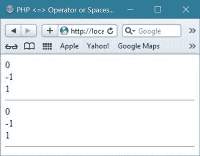

# PHP 操作符

> 原文：<https://codescracker.com/php/php-operators.htm>

[PHP](/php/index.htm) 中的运算符，只是用来对 PHP 脚本中的 [变量](/php/php-variables.htm)和值进行运算。

## PHP 5 操作符

PHP 中有以下类型的操作符:

*   算术运算符
*   赋值运算符
*   条件(三元)运算符
*   比较运算符
*   逻辑运算符
*   递增/递减运算符
*   [字符串](/php/php-strings.htm)运算符(。和=)
*   ？？运算符或合并运算符
*   <=>操作员或飞船操作员(？:)

## PHP 算术运算符

PHP 算术运算符用于执行算术运算，如加法和减法等。下表列出了 PHP 中可用的算术运算符:

| 操作员 | 作品 |
| + | 该运算符将两个操作数相加 |
| - | 该运算符从第一个操作数中减去第二个操作数 |
| / | 这个运算符将分子除以分母 |
| * | 该运算符将两个操作数相乘 |
| % | 这是一个模数运算符，用于求整数除法的余数 |
| ++ | 这是一个增量运算符，将整数值增加 1 |
| - | 这是一个递减运算符，将整数值减一 |

### 例子

下面是一个例子，在 PHP 中使用算术运算符:

```
<!DOCTYPE html>
<html>
<body>

<?php
   $num1 = 30;
   $num2 = 50;

   $res = $num1 + $num2;
   echo "Addition : $res <br/>";
   $res = $num1 - $num2;
   echo "Subtraction : $res <br/>";
   $res = $num1 * $num2;
   echo "Multiplication : $res <br/>";
   $res = $num1 / $num2;
   echo "Division : $res <br/>";
   $res = $num1 % $num2;
   echo "Modulus : $res <br/>";
   $res = $num1++; 
   echo "Increment : $res <br/>";
   $res = $num1--; 
   echo "Decrement : $res <br/>";
?>

</body>
</html>
```

下面是上面的 PHP 脚本产生的输出:


## PHP 赋值运算符

PHP 中的赋值操作符与数值一起使用，将数值写入变量。PHP 中的基本算术运算符(即“=”)用于将右操作数的值赋给左操作数。这里，下表列出了 PHP 中可用的赋值运算符:

| 操作员 | 名字 | 作品 |
| = | 简单赋值运算符 | 该运算符将右侧操作数的值赋给左侧操作数 |
| += | 加法和赋值运算符 | 该运算符用于将右操作数与左操作数相加，然后将结果赋给左操作数 |
| -= | 减法和赋值运算符 | 该运算符从左操作数中减去右操作数，然后将结果赋给左操作数 |
| /= | 除法和赋值运算符 | 该运算符将左操作数除以右操作数，然后将结果赋给左操作数 |
| *= | 乘法和赋值运算符 | 该运算符将右操作数与左操作数相乘，然后将结果赋给左操作数 |
| %= | 模数和赋值运算符 | 该运算符使用两个操作数取模，然后将结果赋给左操作数 |

### 例子

下面是一个例子，使用 PHP 中可用的赋值运算符:

```
<!DOCTYPE html>
<html>
<body>

<?php
   $num1 = 42;
   $num2 = 20;

   $res = $num1 + $num2; 
   echo "Addition Operation Result: $res <br/>";
   $res += $num1;
   echo "Add AND Assignment Operation Result: $res <br/>";
   $res -= $num1;
   echo "Subtract AND Assignment Operation Result: $res <br/>";
   $res *= $num1;
   echo "Multiply AND Assignment Operation Result: $res <br/>";
   $res /= $num1;
   echo "Division AND Assignment Operation Result: $res <br/>";
   $res %= $num1;
   echo "Modulus AND Assignment Operation Result: $res <br/>";
?>

</body>
</html>
```

它将在浏览器中显示以下结果:


现在让我们以 PHP 基本赋值操作符为例。

```
<html>
<head>
   <title>PHP Basic Assignment (=) Operator</title>
</head>
<body>
<?php 
   $fname = "Codes";
   $lname = ($name = "Cracker");
   echo $fname;
   echo "<br/>";
   echo $lname;
   echo "<br/>";
   echo $name;
   echo "<br/>";
   $fullname = ($flname = $fname.$lname);
   echo $fullname;
   echo "<br/>";
   echo $flname;
?>
</body>
</html>
```

下面是 PHP 中上述基本赋值运算符产生的示例输出:


## PHP 比较运算符

PHP 比较运算符用于比较两个值。下表列出了 PHP 中可用的比较运算符:

| 操作员 | 名字 | 操作 | 结果 | 当...的时候 |
| == | 平等的 | 1 美元= 2 美元 | 返回 true | 如果$num1 等于$num2 |
| === | 同一的 | 1 美元= 2 美元 | 返回 true | 如果$num1 等于$num2，并且它们属于同一类型 |
| ！= | 不相等 | 1 美元！= 2 美元 | 返回 true | 如果$num1 不等于$num2 |
| ！== | 不相同 | 1 美元！= 2 美元 | 返回 true | 如果$num1 不等于$num2，或者它们不是同一类型 |
| < | 不到 | 1 美元< 2 美元 | 返回 true | 如果$num1 小于$num2 |
| > | 大于 | 1 美元> 2 美元 | 返回 true | 如果$num1 大于$num2 |
| <> | 不相等 | 一元钱一元钱一元钱二元钱 | 返回 true | 如果$num1 不等于$num2 |
| <= | 小于或等于 | 1 美元< = $ 2 | 返回 true | 如果$num1 小于或等于$num2 |
| <= | 大于或等于 | 1 美元< = $ 2 | 返回 true | 如果$num1 大于或等于$num2 |

### 例子

下面是一个例子，使用 PHP 中可用的比较运算符:

```
<!DOCTYPE html>
<html>
<body>

<?php
   $num1 = 42;
   $num2 = 20;   

   if($num1 == $num2)
   {
      echo "Check1 : num1 is equal to num2<br/>";
   }
   else
   {
      echo "Check1 : num1 is not equal to num2<br/>";
   }
   if($num1 > $num2)
   {
      echo "Check2 : num1 is greater than  num2<br/>";
   }
   else
   {
      echo "Check2 : num1 is not greater than num2<br/>";
   }
   if($num1 < $num2)
   {
      echo "Check3 : num1 is less than  num2<br/>";
   }
   else
   {
      echo "Check3 : num1 is not less than num2<br/>";
   }
   if($num1 != $num2)
   {
      echo "Check4 : num1 is not equal to num2<br/>";
   }
   else
   {
      echo "Check4 : num1 is equal to num2<br/>";
   }
   if($num1 >= $num2)
   {
      echo "Check5 : num1 is either grater than or equal to num2<br/>";
   }
   else
   {
      echo "Check5 : num1 is neither greater than nor equal to num2<br/>";
   }
   if($num1 <= $num2)
   {
      echo "Check6 : num1 is either less than or equal to num2<br/>";
   }
   else
   {
      echo "Check6 : num1 is neither less than nor equal to num2<br/>";
   }
?>

</body>
</html>
```

下面是这个 PHP 脚本产生的输出:


## PHP 递增/递减运算符

PHP 递增/递减运算符用于递增/递减变量的值。下表列出了 PHP 中可用的递增/递减运算符:

| 操作员 | 名字 | 意义 |
| $num1++美元 | 后增量 | 返回$num1，然后将$num1 递增 1 |
| ++＄num 1 | 前增量 | 将$num1 递增 1，然后返回$num1 |
| $num1 - | 后减量 | 返回$num1，然后将$num1 减 1 |
| - $num1 | 预减量 | 将＄num 1 减 1，然后返回＄num 1 |

简单地说，PHP 递增(++)操作符用于将 PHP 变量的值递增 1。

您可以在变量之前或之后设置递增运算符。

PHP 递减(-)运算符用于将 PHP 变量的值递减 1。

您可以在变量之前或之后设置递减运算符。

### 例子

下面是一个例子，使用 PHP 中可用的递增/递减运算符:

```
<!DOCTYPE html>
<html>
<body>

<?php
   $num1 = 0;
   $num2 = 0;

   echo "$num1"."<br/>";

   $num2 = ++$num1;
   echo "$num2"."<br/>";

   $num2 = $num1++;
   echo "$num2"."<br/>";

   $num2 = --$num1;  
   echo "$num2"."<br/>";

   $num2 = $num1--;
   echo "$num2"."<br/>";
?>

</body>
</html>
```

上述 PHP 脚本产生以下输出:


再举一个 PHP 中增量(++)和减量(-)运算符的例子。

```
<html>
<head>
   <title>PHP increment and decrement operator</title>
</head>
<body>
<?php 
   # PHP increment (++) and decrement (--) operator 
   # example with all the four option, that is,
   # pre-increment, post-increment,
   # pre-decrement and post-decrement
   $value1 = 5;
   $value2 = 5;
   $value3 = $value1++;
   $value4 = ++$value2;
   echo $value1;
   echo "<br/>";
   echo $value2;
   echo "<br/>";
   echo $value3;
   echo "<br/>";
   echo $value4;
   echo "<hr/>";

   $valueb1 = 5;
   $valueb2 = 5;
   $valueb3 = $valueb1--;
   $valueb4 = --$valueb2;
   echo $valueb1;
   echo "<br/>";
   echo $valueb2;
   echo "<br/>";
   echo $valueb3;
   echo "<br/>";
   echo $valueb4;
   echo "<hr/>";
?>
</body>
</html>
```

下面是上述 PHP 增量和减量示例代码产生的示例输出:


## PHP 逻辑运算符

PHP 逻辑运算符用于组合条件语句。这里，下表列出了 PHP 中可用的逻辑运算符:

| 操作员 | 名字 | 操作 | 结果 | 当...的时候 |
| 或者 | 或者 | $num1 或$num2 | 真实的 | 如果$num1 或$num2 为真 |
| 和 | 和 | $num1 和$num2 | 真实的 | 如果$num1 和$num2 都为真 |
| 异或运算 | 异或运算 | 一块钱，一块钱，一块钱，一块钱，一块钱，一块钱，一块钱，一块钱，一块钱，一块钱，一块钱 | 真实的 | 如果$num1 或$num2 为真，但不同时为真 |
| &#124;&#124; | 或者 | 1 美元兑换 1 美元，2 美元兑换 1 美元，2 美元兑换 1 美元，2 美元兑换 1 美元，2 美元兑换 1 美元，2 美元兑换 1 美元，2 美元兑换 1 美元，2 美元兑换 1 美元，2 美元兑换 1 美元，2 美元兑换 1 美元 | 真实的 | 如果$num1 或$num2 为真 |
| && | 和 | 1 美元和 2 美元 | 真实的 | 如果$num1 和$num2 都为真 |
| ！ | 不 | ！$num1 | 真实的 | 如果$num1 不为真 |

### 例子

下面是一个例子，使用 PHP 中可用的逻辑运算符:

```
<!DOCTYPE html>
<html>
<body>

<?php
   $num1 = 42;
   $num2 = 0;

   if($num1 && $num2)
   {
      echo "Check1 : Both num1 and num2 are true<br/>";
   }
   else
   {
      echo "Check1 : Either num1 or num2 is false<br/>";
   }
   if($num1 and $num2)
   {
      echo "Check2 : Both num1 and num2 are true<br/>";
   }
   else
   {
      echo "Check2 : Either num1 or num2 is false<br/>";
   }
   if($num1 || $num2)
   {
      echo "Check3 : Either num1 or num2 is true<br/>";
   }
   else
   {
      echo "Check3 : Both num1 and num2 are false<br/>";
   }
   if($num1 or $num2)
   {
      echo "Check4 : Either num1 or num2 is true<br/>";
   }
   else
   {
      echo "Check4 : Both num1 and num2 are false<br/>";
   }

   $num1 = 10;
   $num2 = 20;

   if($num1)
   {
      echo "Check5 : num1 is true <br/>";
   }
   else
   {
      echo "Check5 : num1  is false<br/>";
   }
   if($num2)
   {
      echo "Check6 : num2 is true <br/>";
   }
   else
   {
      echo "Check6 : num2  is false<br/>";
   }
   if(!$num1)
   {
      echo "Check7 : num1 is true <br/>";
   }
   else
   {
      echo "Check7 : num1  is false<br/>";
   }
   if(!$num2)
   {
      echo "Check8 : num2 is true <br/>";
   }
   else
   {
      echo "Check8 : num2  is false<br/>";
   }
?>

</body>
</html>
```

下面是上面的 PHP 脚本产生的输出:


让我们以 PHP 中的逻辑 AND 和逻辑 OR 运算符为例。

```
<html>
<head>
   <title>PHP Logical AND (&&) and OR (||) Operator</title>
</head>
<body>

<?php 
   $num1 = 5;
   $num2 = 10;
   $num3 = 5;
   $num4 = 10;
   if($num1==$num2 && $num1==$num3)
   {
      echo "1\. Both expression returns to be true.<br/>";
   }
   if($num1==$num2 || $num1==$num3)
   {
      echo "2\. Either of the two expression returns to be true.</br>";
   }
   if($num1==$num3 && $num2==$num4)
   {
      echo "3\. Both expression returns to be true.<br/>";
   }
   if($num1==$num3 || $num2==$num4)
   {
      echo "4\. Either of the two expression returns to be true.<br/>";
   }
?>
</body>
</html>
```

以下是 PHP 中上述逻辑 AND 和逻辑 OR 运算符的示例输出:


## PHP 条件运算符

PHP 条件操作符是任何编程语言中都可用的重要操作符。条件运算符就像 if-else 运算符一样进行计算。下面是 PHP 中条件运算符的一般形式:

```
var = expression ? value1 : value2;
```

这里，表达式是 PHP 中任何有效的表达式。如果表达式的计算结果为 true，则将值 1 赋给变量(var)，否则，将值 2 赋给变量(var)。下面是一个例子，在 PHP 中使用条件运算符:

```
<!DOCTYPE html>
<html>
<body>

<?php
   $num1 = 10;
   $num2 = 20;

   $result = ($num1 > $num2 ) ? $num1 : $num2;
   echo "Check1 : Value of result is $result<br/>";

   $result = ($num1 < $num2 ) ? $num1 : $num2;
   echo "Check2 : Value of result is $result<br/>";
?>

</body>
</html>
```

它将显示以下结果:


## PHP 三元运算符

PHP 三元运算符也可以称为 PHP 条件运算符。

PHP 三元运算符还是？:PHP 中的运算符类似于 PHP if 语句，如？:运算符如果条件返回为真，则将返回第一个块的值，否则将返回第二个块的值。

下面是 PHP 三元运算符(？:)

```
$val = expression ? firstValue : secondValue
```

让我们举一个用 PHP 演示三元运算符的例子。

```
<html>
<head>
   <title>PHP ternary operator (?:)</title>
</head>
<body>

<?php 
   $num1 = 5;
   $num2 = 10;
   $val = $num1>$num2 ? "right" : "wrong";
   echo $val;
   echo "<hr/>";

   $num1 = 5;
   $num2 = 10;
   $val = $num1<$num2 ? "right" : "wrong";
   echo $val;
   echo "<hr/>";

   $num1 = 5;
   $num2 = 10;
   $val = $num1>$num2 ? 1 : 0;
   echo $val;
   echo "<hr/>";

   $num1 = 5;
   $num2 = 10;
   $val = $num1<$num2 ? 1 : 0;
   echo $val;
   echo "<hr/>";
?>
</body>
</html>
```

下面是上面的 PHP 三元运算符示例代码产生的示例输出:


## PHP 字符串操作符(。和=)

PHP 字符串操作符，也就是点(。)用于组合 PHP 和。=用于组合两个变量，并将其赋给一个变量。

让我们举一个例子来演示 PHP 中的字符串操作符

```
<html>
<head>
   <title>PHP String Operator (. and =)</title>
</head>
<body>
<?php 
   $fname = "Codes";
   $lname = "Cracker";
   $fullname = $fname . $lname;
   echo $fullname;
   echo "<hr/>";
   $firstname = "Codes";
   $firstname .= "Cracker";
   echo $firstname;
   echo "<hr/>";
?>
</body>
</html>
```

下面是上面的 PHP 字符串运算符示例代码产生的示例输出:


## PHP <=>或宇宙飞船操作员

PHP <=>操作符或者飞船操作符是 PHP 中的一个新操作符，是在 PHP 7 版本，也就是 PHP 7 中出现的。

PHP 中的<=>运算符用于比较表达式。

PHP 中的飞船或<=>操作符会在三种不同的情况下返回以下三个值:

*   如果第一个表达式小于第二个表达式，则返回-1
*   如果第一个表达式等于第二个表达式，则返回 0
*   如果第一个表达式大于第二个表达式，则返回 1

让我们举一个例子来说明 PHP 中的飞船操作符。

```
<html>
<head>
   <title>PHP <=> Operator or Spaceship Operator</title>
</head>
<body>
<?php 
   print (5 <=> 5);
   echo "<br/>";
   print (3 <=> 5);
   echo "<br/>";
   print (5 <=>3);
   echo "<hr/>";
   print ("C" <=> "C");
   echo "<br/>";
   print ("A" <=> "C");
   echo "<br/>";
   print ("C" <=> "A");
   echo "<hr/>";
?>
</body>
</html>
```

上面的 PHP 飞船操作符示例代码将产生以下输出:



## PHP？？or 合并运算符

那个？？PHP 中的运算符是在其第 7 版，即 PHP 7 中引入的。

用 PHP？？or 合并运算符，如果设置了该运算符的第一个操作数，则返回第一个操作数，否则该运算符将返回第二个操作数。

这里有一个例子，演示了 PHP 合并或？？接线员。

```
<html>
<head>
   <title>PHP ?? Operator or Coalescing Operator</title>
</head>
<body>
<?php 
   $firstname = "Codes";
   $lastname = "Cracker";
   $fullname = $_POST['name'] ?? 'name is empty';
   echo $fullname;
   echo "<hr/>";
   $name = $firstname ?? "firstname is not initialized";
   echo $name;
   echo "<hr/>";
   $name = $surname ?? "surname is undefined";
   echo $name;
   echo "<hr/>";
   $name = $fullname ?? "fullname is set previously";
   echo $fullname;
?>
</body>
</html>
```

下面是上面 PHP 合并操作符的输出示例。


## PHP 运算符优先级

| 结合性 | 操作员 |
| 左边的 | -> | :: |  |  |  |  |  |  |  |  |
|  | 克隆 | 新的 |  |  |  |  |  |  |  |  |
|  | [ |  |  |  |  |  |  |  |  |  |
|  | ** |  |  |  |  |  |  |  |  |  |
| 正确 | ++ | - | ~ | (整数) | (浮动) | (字符串) | (数组) | (对象) | (布尔) | @ |
|  | instanceof |  |  |  |  |  |  |  |  |  |
|  | ！ |  |  |  |  |  |  |  |  |  |
| 左边的 | * | / | % |  |  |  |  |  |  |  |
| 左边的 | + | - | 。 |  |  |  |  |  |  |  |
| 左边的 | << | >> |  |  |  |  |  |  |  |  |
|  | < | <= | > | >= |  |  |  |  |  |  |
|  | == | ！= | === | ！== | <> | <=> |  |  |  |  |
|  | & |  |  |  |  |  |  |  |  |  |
|  | ^ |  |  |  |  |  |  |  |  |  |
|  | &#124; |  |  |  |  |  |  |  |  |  |
|  | && |  |  |  |  |  |  |  |  |  |
|  | &#124;&#124; |  |  |  |  |  |  |  |  |  |
|  | ？？ |  |  |  |  |  |  |  |  |  |
|  | ？： |  |  |  |  |  |  |  |  |  |
| 正确 | = | += | -= | *= | **= | /= | 。= | %= | &= |  |
|  | 和 |  |  |  |  |  |  |  |  |  |
|  | 异或运算 |  |  |  |  |  |  |  |  |  |
|  | 或者 |  |  |  |  |  |  |  |  |  |

[PHP 在线测试](/exam/showtest.php?subid=8)

* * *

* * *