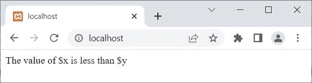

# PHP 中的决策或条件语句

> 原文：<https://codescracker.com/php/php-decision-making.htm>

本文涵盖了 PHP 中使用的决策或条件语句，它们是:

*   [if](/php/php-if-elseif-else-statement.htm) 语句
*   [如果...else](/php/php-if-elseif-else-statement.htm) 语句
*   [如果...埃尔塞夫...else](/php/php-if-elseif-else-statement.htm) 语句
*   [开关](/php/php-switch.htm)声明

## PHP 决策语句示例

这是一个例子，展示了在 PHP 中如何使用决策语句来控制程序。

```
<?php
   $x = 10;
   $y = 20;

   if($x<$y)
      echo "The value of \$x is less than \$y";
?>
```

上面的 PHP 决策语句示例产生的输出是:



由于 **$x** 的值是 **10** ，而 **$y** 的值是 **20** 。因此，条件 **$x < $y** 或 **10 < 20** 评估为**真**。因此，如果，程序流执行**主体中的语句 。**

让我创建另一个例子，如果指定的条件评估为**假**，则执行其他代码块:

```
<?php
   $x = 8;
   $y = 5;

   if($x<$y)
      echo "The value of \$x is less than \$y";
   else
      echo "The value of \$x is greater than \$y";
?>
```

输出应该是:

```
The value of $x is greater than $y
```

让我再举最后一个例子:

```
<?php
   $x = 8;
   $y = 8;

   if($x<$y)
      echo "The value of \$x is less than \$y";
   elseif($x>$y)
      echo "The value of \$x is greater than \$y";
   else
      echo "The value of \$x is equal to \$y";
?>
```

输出应该是:

```
The value of $x is equal to $y
```

**注-** 关于**开关**的详细描述连同这些 **if...埃尔塞夫...其他的**将在 单独的教程中介绍。

[PHP 在线测试](/exam/showtest.php?subid=8)

* * *

* * *