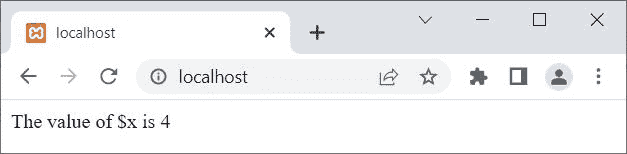

# PHP 开关语句

> 原文：<https://codescracker.com/php/php-switch.htm>

当我们需要基于多个 案例/标签(条件)执行特定代码块时，使用 PHP **switch** 语句。例如:

```
<?php
   $x = 4;
   switch($x)
   {
      case 1:
         echo "The value of \$x is 1";
         break;
      case 2:
         echo "The value of \$x is 2";
         break;
      case 3:
         echo "The value of \$x is 3";
         break;
      case 4:
         echo "The value of \$x is 4";
         break;
      case 5:
         echo "The value of \$x is 5";
         break;
      case 6:
         echo "The value of \$x is 6";
         break;
      case 7:
         echo "The value of \$x is 7";
         break;
      case 8:
         echo "The value of \$x is 8";
         break;
      default:
         echo "The value of \$x is unknown";
   }
?>
```

上面的 PHP 示例产生的输出显示在下面给出的快照中:



也就是说，**开关**的 **()** 括号内的代码被认为是单个表达式，将被 求值一次。因此 **$x** 被求值，求值后的值将是 **4** ，因为 **$x** 的值是 4。现在这个 4 和结构中的每一个案例进行比较。由于 **4** 与 **案例 4** 匹配，因此与该案例相关的代码块将被执行。

**注意-** 使用 [break](/php/php-break-continue-keyword.htm) 关键字/语句，跳过剩余案例的执行。

**注意-****默认**情况用于执行一些代码块，如果没有找到匹配的话。

我们可以用**开关**语句来代替**如果...埃尔塞夫...否则**。例如，上面的例子 也可以用[来写，如果...埃尔塞夫..else](/php/php-if-elseif-else-statement.htm) 语句:

```
<?php
   $x = 4;
   if($x==1)
      echo "The value of \$x is 1";
   elseif($x==2)
      echo "The value of \$x is 2";
   elseif($x==3)
      echo "The value of \$x is 3";
   elseif($x==4)
      echo "The value of \$x is 4";
   elseif($x==5)
      echo "The value of \$x is 5";
   elseif($x==6)
      echo "The value of \$x is 6";
   elseif($x==7)
      echo "The value of \$x is 7";
   elseif($x==8)
      echo "The value of \$x is 8";
   else
      echo "The value of \$x is unknown";
?>
```

您将获得与上一个示例相同的输出。

## PHP switch 语句语法

PHP 中 **switch** 语句的语法是:

```
switch(x)
{
   case label1:
      // block of code to execute, if x==label1
      break;
   case label2:
      // block of code to execute, if x==label2
      break;
   case label3:
      // block of code to execute, if x==label3
      break;
   .
   .
   .
   case labelN:
      // block of code to execute, if x==labelN
      break;
   default:
      // block of code to execute, if no match found
}
```

## PHP switch 语句示例

```
<?php
   $day = date("D");
   switch ($day)
   {
      case "Mon":
         echo "Today is Monday";
         break;
      case "Tue":
         echo "Today is Tuesday";
         break;
      case "Wed":
         echo "Today is Wednesday";
         break;
      case "Thu":
         echo "Today is Thursday";
         break;
      case "Fri":
         echo "Today is Friday";
         break;
      case "Sat":
         echo "Today is Saturday";
         break;
      case "Sun":
         echo "Today is Sunday";
         break;
      default:
         echo "What! are you an alien?";
   }
?>
```

因为这里是**周日**，所以当我写这篇文章时，输出应该是:

```
Today is Sunday
```

[PHP 在线测试](/exam/showtest.php?subid=8)

* * *

* * *