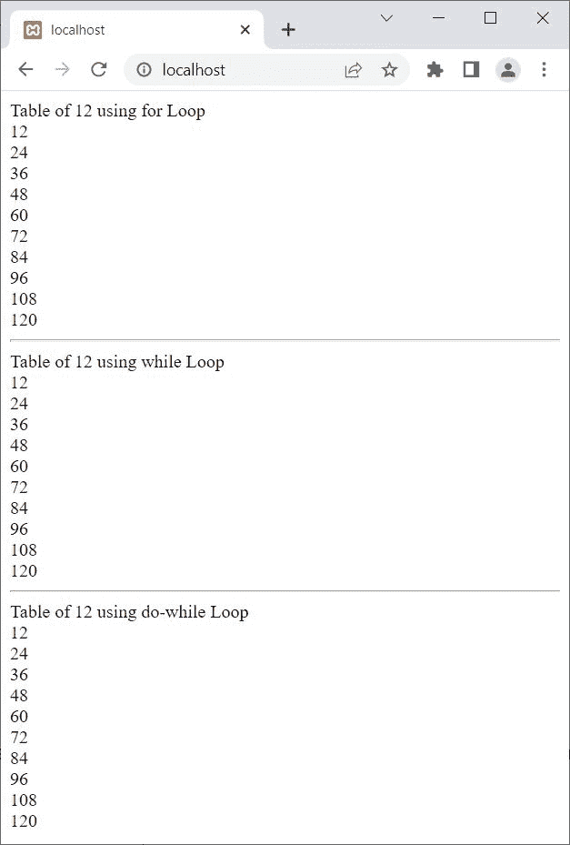
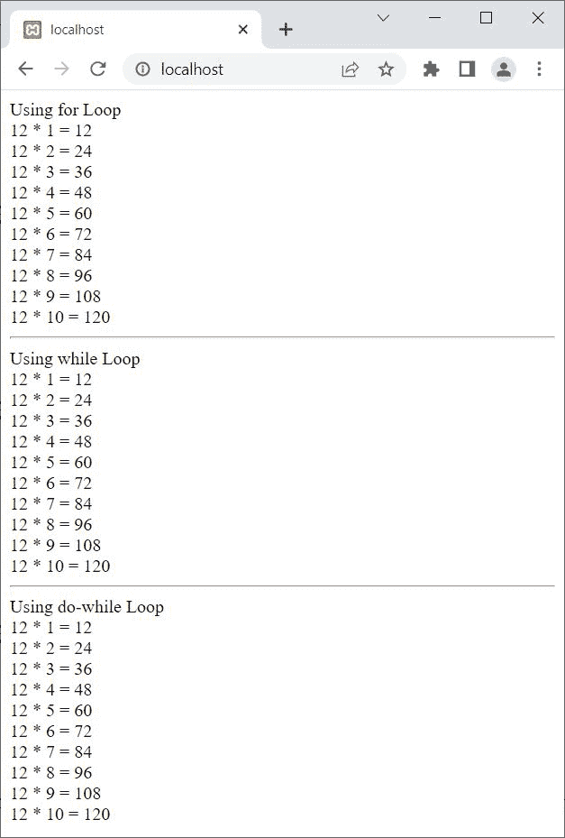

# PHP 中的循环

> 原文：<https://codescracker.com/php/php-loops.htm>

在 PHP 中，当我们需要多次执行某个代码块时。然后循环进入画面。也就是说，根据循环的条件，循环用于多次执行指定的代码块。

## PHP 中的循环类型

PHP 中可以使用四种类型的循环:

1.  [为循环](/php/php-for-loop.htm)
2.  [while 循环](/php/php-while-loop.htm)
3.  [do-while 循环](/php/php-do-while-loop.htm)
4.  [foreach 循环](/php/php-foreach-loop.htm)

**注意-****foreach**循环只对数组有效。

## PHP 循环示例

让我用 PHP 创建一个循环的例子。我将使用**为**、 **while** 、 和 **do-while** 循环打印 12 个表:

```
<?php
   $num = 12;
   echo "Table of $num using for Loop<BR>";
   for($i=1; $i<=10; $i++)
   {
      echo $num*$i;
      echo "<BR>";
   }

   echo "<HR>";

   echo "Table of $num using while Loop<BR>";
   $i=1;
   while($i<=10)
   {
      echo $num*$i;
      echo "<BR>";
      $i++;
   }

   echo "<HR>";

   echo "Table of $num using do-while Loop<BR>";
   $i=1;
   do
   {
      echo $num*$i;
      echo "<BR>";
      $i++;
   }while($i<=10);
?>
```

上面 PHP 循环示例产生的输出显示在下面给出的快照中:



上述程序也可以这样修改和简化:

```
<?php
   $num = 12;
   echo "Using for Loop<BR>";
   for($i=1; $i<=10; $i++)
      echo "$num * $i = ", $num*$i, "<BR>";

   echo "<HR>";

   echo "Using while Loop<BR>";
   $i=1;
   while($i<=10)
      echo "$num * $i = ", $num*$i++, "<BR>";

   echo "<HR>";

   echo "Using do-while Loop<BR>";
   $i=1;
   do
   {
      echo "$num * $i = ", $num*$i++, "<BR>";
   }while($i<=10);
?>
```

现在的输出是:



让我在 PHP 中创建最后一个循环(foreach 循环)示例:

```
<?php
   $myarr = array("Python", "CSS", "JS", "PHP", "SQL");
   foreach($myarr as $x)
   {
      echo $x;
      echo "<BR>";
   }
?>
```

输出应该是:

```
Python
CSS
JS
PHP
SQL
```

**注-** 关于任何循环的细节，要么跟随本段之后的**下一个教程**，要么 使用本文开头给出的链接直接参考单独的教程。

[PHP 在线测试](/exam/showtest.php?subid=8)

* * *

* * *