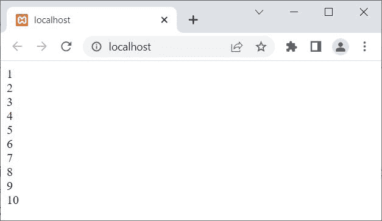
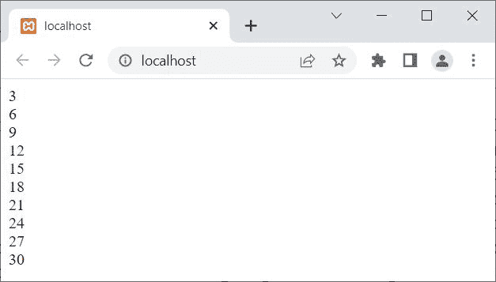
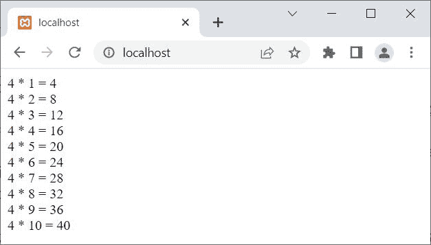

# PHP`for`循环

> 原文：<https://codescracker.com/php/php-for-loop.htm>

PHP 中的循环的**在我们需要多次执行某个代码块时使用。例如:**

```
<?php
   for($x=1; $x<=10; $x++)
      echo $x, "<BR>";
?>
```

输出是:



循环内的代码块将被执行的次数，取决于循环的条件被评估为**真**的次数。在上面的例子中，由于条件**$ x<= 10；** 十次评估为**真**，因此语句**回显$x，“<BR>”；**已经执行 十次。

上面的程序也可以写成:

```
<?php
   for($x=1; $x<=10; $x++)
   {
      echo $x;
      echo "<BR>";
   }
?>
```

## PHP`for`循环语法

PHP 中循环的**的语法是:**

```
for(initialize; condition; update)
{
   block of code;
}
```

循环的**从**初始化**开始执行。该语句在 循环开始时执行，并且只执行一次。这个用来初始化循环变量，例如:**$ x = 1；****

在进入循环体之前，**状态；**表达式必须被评估为**真**。

如果**条件成立；**评估为**真**，然后**代码块；**将被执行。

执行完**块代码后；**，程序流程转到**更新**循环部分，更新 循环变量。

更新循环变量后，**条件；如前所述，在进入 循环之前，**条件被评估；**表达式必须被评估为**真**。**

这个过程继续，直到**状态；**评估为**假**。

## PHP`for`循环示例

现在让我为循环创建一个**的例子，并给出它的输出和深入描述:**

```
<?php
   for($num=3; $num<=30; $num=$num+3)
   {
      echo $num;
      echo "<BR>";
   }
?>
```

上面的 PHP 示例在*上为*循环产生的输出显示在下面给出的快照中:



上述示例的预演是:

*   值 **3** 已经被初始化为变量 **$num** ，因为最初第一条语句( **initialize** ) 总是首先执行，并且只执行一次
*   现在，由于条件 **$num < =30** 或 **3 < =30** 评估为**真**
*   因此，程序流进入循环内部
*   使用两个 [echo](/php/php-echo.htm) 语句，首先打印出 **$num** 的值 ，然后使用 **BR** 标签插入一个换行符
*   现在程序流程转到**更新**部分，将执行那里可用的语句， 即 **$num=$num+3**
*   使用**更新**语句， **$num** 的值将增加 3。因此，现在 **$num=6**
*   同样，条件 **$num < =30** 将使用新的值 **$num** 进行评估
*   也就是说，条件 **$num < =30** 或 **6 < =30** 再次评估为**真**
*   因此，程序流再次进入循环
*   并且 **$num** 的值为 6，将被打印在输出上，后跟一个新的行或换行符
*   使用**更新**语句， **$num** 的值将再次增加 3。现在 **$num=9**
*   条件 **$num < =30** 或 **9 < =30** 在第三次评估为**真**
*   因此，程序流再次第三次进入循环
*   这个过程继续，直到条件评估为**假**

您还可以使用多个初始化、更新和/或条件语句。例如，在下面的例子中，我将为循环的**初始化**部分使用两个初始化代码:

```
<?php
   for($num=4, $i=1; $i<=10; $i++)
      echo "$num * $i = ", $num*$i, "<BR>";
?>
```

此示例的输出显示在下面给出的快照中:



**注-** 关于对**条件使用多个条件语句；**循环的一部分，当任何条件语句评估为**假**时，循环的执行 停止。

[PHP 在线测试](/exam/showtest.php?subid=8)

* * *

* * *