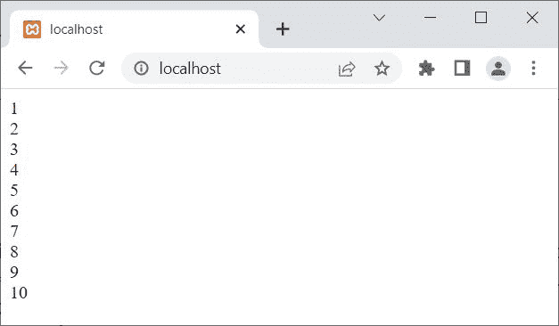
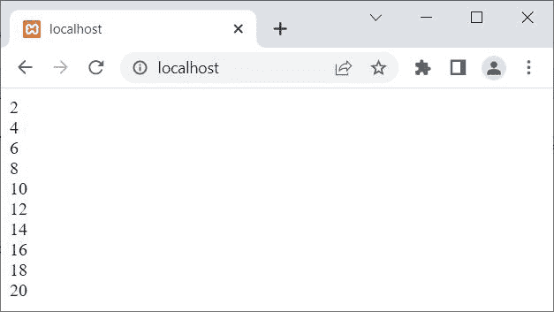
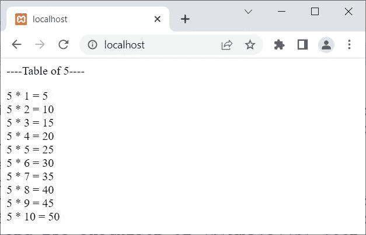

# PHP`while`循环

> 原文：<https://codescracker.com/php/php-while-loop.htm>

PHP 中的 **while** 循环在我们需要多次执行某个代码块时使用。例如:

```
<?php
   $x = 1;
   while($x<=10)
   {
      echo $x, "<BR>";
      $x++;
   }
?>
```

上面的 PHP 示例产生的输出是:



## PHP`while`循环语法

PHP 中使用 **while** 循环的语法是:

```
while(condition)
{
   block of code;
}
```

**代码块；**将继续执行，直到**条件**评估为**假**。

## PHP`while`循环示例

以下是 PHP 中关于 **while** 循环的示例及其输出和深入描述:

```
<?php
   $num = 2;
   while($num<=20)
   {
      echo $num, "<BR>";
      $num = $num+2;
   }
?>
```

上述 PHP 示例的输出显示在下面给出的快照中:



**注意-****里面的无论什么表达式，while()** 都会被认为是条件表达式。 对条件表达式求值后，返回一个布尔值(**真**或**假**)。 如果布尔值为**真**，则继续执行**而**循环，否则如果 条件表达式评估为**假**，则停止执行**而**循环。

上述示例的预演如下:

1.  变量 **$num** 被定义为其值为 **2**
2.  现在开始执行**而**循环
3.  因为首先，条件 **$num < =20** 或 **2 < =20** 评估为**真**
4.  因此程序流进入循环内部
5.  使用语句:`echo $num, "<BR>";`
6.  **$num** 的值，即 **2** ，连同一个换行符将被打印在输出上
7.  现在循环的第二条语句，即:
    `$num = $num+2;`
    被执行
8.  因此 **$num+2** 或 **2+2** 或 **4** 将被初始化为 **$num** 。现在 **$num = 4**
9.  由于循环内的所有语句都已执行，因此程序流程再次转到 **while** 循环的条件表达式，再次检查条件
10.  第二次，条件 **$num < =20** 或 **4 < =20** 再次评估为**真**
11.  因此，程序流再次进入循环
12.  现在，类似的过程再次进行，从步骤 5 到步骤 9，当然使用新的值 **$num**
13.  这个过程继续，直到 **$num** 的值变得大于 20
14.  因为，当 **$num** 的值变得大于 20 时，那么条件 **$num < =20** 评估为**假**，并且**的执行同时**循环停止

让我在 PHP 中创建另一个关于 **while** 循环的例子:

```
<?php
   $num = 5;
   $i = 1;
   echo "<p>----Table of $num----</p>";
   while($i<=10)
   {
      echo "$num * $i = ", $num*$i, "<BR>";
      $i++;
   }
?>
```

现在输出应该是:



下面是 PHP 中 **while** 循环的最后一个例子:

```
<?php
   $sum = 0;
   $count = 0;
   $check = true;

   while($check)
   {
      if($sum === 500)
         $check = false;
      else 
         $sum += 10;
      $count++;
   }
   $count--;

   echo "<p>Value of \$sum = ", $sum, "</p>";
   echo "<p>Number of times, loop executed = ", $count, "</p>";
?>
```

输出应该是:

```
Value of $sum = 500

Number of times, loop executed = 50
```

[PHP 在线测试](/exam/showtest.php?subid=8)

* * *

* * *