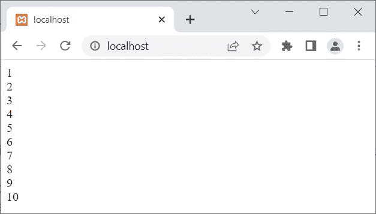

# PHP do-`while`循环

> 原文：<https://codescracker.com/php/php-do-while-loop.htm>

**做什么...而 PHP 中的**循环是在我们需要至少执行一次某个代码块时使用的，然后 需要继续执行同一个代码块，直到指定的条件评估为**假**。 例如:

```
<?php
   $x = 1;
   do{
      echo $x, "<BR>";
      $x++;
   }while($x<=10);
?>
```

下面给出的快照显示了上面的 PHP 示例产生的示例输出:



## PHP do-`while`循环语法

**do 的语法...而 PHP 中的**循环，则是:

```
do{
   block of code;
}while(condition);
```

首先是**代码块；**被执行，然后**条件**表达式被求值。如果 **条件**评估为**真**，则**代码块；再次被处决。该过程 继续，直到**条件**评估为**假**。**

## PHP do-`while`循环示例

如前所述，如果**条件**在第一次运行时评估为**假**，那么在那种情况下， 代码块也是如此；将被执行一次。例如:

```
<?php
   $x = 10;
   do{
      echo "<p>The value of \$x is $x</p>";
      $x--;
   }while($x<5);
?>
```

输出应该是**$ x 的值是 10** 。也就是说， 循环体中的语句只被执行过一次。

[PHP 在线测试](/exam/showtest.php?subid=8)

* * *

* * *