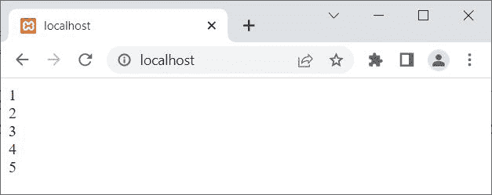
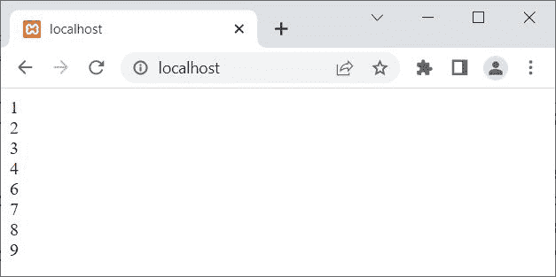
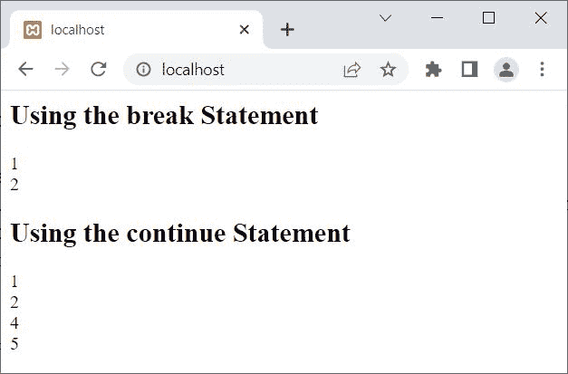

# PHP 中的中断并继续语句

> 原文：<https://codescracker.com/php/php-break-continue-keyword.htm>

本文旨在涵盖 PHP 中的两个重要语句或关键词，即:

1.  破裂
2.  继续

## PHP`break`语句

PHP 的 **break** 关键字或语句，是当我们需要退出当前的[循环](/php/php-loops.htm)或 [切换](/php/php-switch.htm)结构时使用的。例如:

```
<?php
   for($i=1; $i<10; $i++)
   {
      if($i>5)
         break;

      echo $i;
      echo "<BR>";
   }
?>
```

下面给出的快照显示了这个 PHP 示例在执行 **break** 语句时产生的输出:



在上面的例子中，当 **$i** 的值大于 5 时，也就是当 **$i** 的值变为 6 时，那么条件 **$i > 5** 或 **6 > 5** 评估为**真**，因此，如果块和**中断，程序 流程进入[内部；](/php/php-if-elseif-else-statement.htm)**语句被执行，这跳过了当前**对于**循环的剩余 执行。因此，我们只得到从 1 到 5 的输出。

**break** 语句跳过剩余语句(如果有的话)的执行，以及当前循环的所有剩余 迭代。

**break** 语句也可以用来停止无限循环的执行(条件 总是评估为**真**的循环)。例如:

```
<?php
   $num = 10;
   while(true)
   {
      echo $num, "<BR>";

      if($num==12)
         break;

      $num++;
      echo $num, "<BR>";
   }
?>
```

这个 PHP 示例的输出应该是:


看循环的条件，是**真**，显然永远评估为**真**。因此， 使用**中断**语句，该循环的执行结束。

上述示例的预演如下:

*   使用第一条语句将值 10 初始化为变量 **$num**
*   现在开始执行[而](/php/php-while-loop.htm)循环
*   由于循环的条件是**真**，因此，循环将无限执行
*   在第一次迭代中，使用[echo](/php/php-echo.htm),**$ num**的值与使用 **BR** 标签的换行符 一起打印出来
*   由于条件 **$num==12** 或 **10==12** 评估为**假**，因此如果块执行**中断**语句，程序流 将不会进入**块**
*   **$num** 的值增加 1。现在 **$num=11**
*   **$num** 的值再次与换行符一起打印出来
*   现在循环的第二次迭代开始了
*   这个过程继续，直到 **$num** 的值变为 12
*   当 **$num** 的值变为 12 时，则条件 **$num==12** (如果**的)评估 为**真**，**中断；**语句被执行，这迫使 **while** 循环停止 它的执行**

## PHP`continue`语句

当我们需要为当前循环的当前迭代跳过剩余语句 的执行，并为当前循环的下一次迭代继续时，使用 PHP **continue** 语句或关键字。例如:

```
<?php
   for($i=1; $i<10; $i++)
   {
      if($i==5)
         continue;

      echo $i;
      echo "<BR>";
   }
?>
```

上面的 PHP 示例在 **continue** 语句上的输出是:



在上面的例子中，当 **$i** 的值变为 5 时，那么条件 **$i==5** 评估为**真**。 因此**继续；执行**语句，强制跳转并继续执行当前循环的下一个 迭代。也就是说，两个 **echo** 语句在该迭代中被跳过。

## PHP 中中断和继续的区别

**break** 用于跳过当前循环的所有剩余执行和迭代。而 **继续**用于跳过 当前循环的当前迭代的剩余语句的执行。例如:

```
<?php
   echo "<h2>Using the break Statement</h2>";
   for($i=1; $i<=5; $i++)
   {
      if($i==3)
         break;
      echo $i, "<BR>";
   }

   echo "<h2>Using the continue Statement</h2>";
   for($i=1; $i<=5; $i++)
   {
      if($i==3)
         continue;
      echo $i, "<BR>";
   }
?>
```

上述 PHP 示例的输出是:



[PHP 在线测试](/exam/showtest.php?subid=8)

* * *

* * *