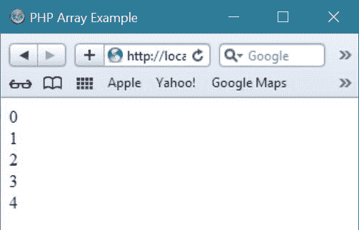

# PHP 数组

> 原文：<https://codescracker.com/php/php-arrays.htm>

[PHP](/php/index.htm) 数组用于在单个 [变量](/php/php-variables.htm)中存储多个值。

## 在 PHP 中创建一个数组

你必须使用一个名为 array()的函数来创建一个数组。下面是在 PHP 中创建数组的一般形式:

```
array();
```

## 用 PHP 初始化一个数组

下面是一些在 PHP 中初始化数组的示例方法。

```
// initialize an empty array in PHP
$array_var = array();

// shorthand notation of initializing an empty array in PHP 
$array_var = [];

// initialize a simple array with some values in PHP 
$tutorial_var = array('PHP', 'Array', 'One dimensional Array', 'Multidimensional Array');

// shorthand notation of initializing array with some values in PHP 
$tutorial_var = ['PHP', 'Array', 'One dimensional Array', 'Multidimensional Array'];

// initialize simple associative array in PHP 
$tutorial_var = array(
   'first' => 'PHP',
   'second' => 'Array', 
   'third' => 'One Dimensional Array',
   'fourth' => 'Multidimensional Array'
);

// initialize and set an array with key and value in PHP
$tutorial_var['second'] = 'Array';

// shorthand notation of initializing an array with some values in PHP 
$tutorial_var = [
   'first' => 'PHP',
   'second' => 'Array', 
   'third' => 'One Dimensional Array',
   'fourth' => 'Multidimensional Array'
];
```

## 获取 PHP 中数组的长度

在 PHP 中要获得一个数组的长度，只需使用 count()函数，返回数组的长度(元素的个数)。下面是一个例子，在 PHP 中使用 count()函数来求数组的长度:

```
<!DOCTYPE html>
<html>
<head>
   <title>Getting Array Length Example in PHP</title>
</head>
<body>
<?php
   $cars = array("Audi", "BMW", "Mercedes");
   echo count($cars);
?>
</body>
</html>
```

以下是上述 PHP 脚本的输出:


## PHP 数组示例

下面是 PHP 中数组的一个例子:

```
<!DOCTYPE html>
<html>
<head>
   <title>PHP Array Example</title>
</head>
<body>
<?php
   // array example in PHP
   $cars = array('Audi', 'BMW', 'Mercedes');
   echo "I like these cars :<br/>";
   echo $cars[0].", ".$cars[1].", and ".$cars[2];
?>
</body>
</html>
```

以下是上述 PHP 脚本的输出:


下面是一个用 PHP 演示数组的例子。

```
<!DOCTYPE html>
<html>
<head>
   <title>PHP Array Example</title>
</head>
<body>
<?php
   $tot = 5;
   for($i=0; $i<$tot; $i++)
   {
      $array_var[$i] = $i;
   }
   for($i=0; $i<$tot; $i++)
   {
      echo $array_var[$i]."<br/>";
   }
?>
</body>
</html>
```

上述 PHP 数组示例代码将产生如下输出:



让我们再举一个 PHP 中数组的例子

```
<!DOCTYPE html>
<html>
<head>
   <title>PHP Array Example</title>
</head>
<body>
<?php
   $num = 2;
   for($i=1; $i<=10; $i++)
   {
      $array_var[$i] = $num * $i;
   }
   for($i=1; $i<=10; $i++)
   {
      echo $array_var[$i]."<br/>";
   }
?>
</body>
</html>
```

以下是上述数组示例代码的示例输出


## PHP 中数组的类型

PHP 中有以下三种类型的数组:

*   关联数组
*   索引数组
*   多维数组

## PHP 索引数组

在 PHP 中创建索引数组有两种方法。可以像这样自动分配索引:

```
$cars = array("Audi", "BMW", "Mercedes");
```

或者，您可以像这样手动分配索引:

```
$cars[0] = "Audi";
$cars[1] = "BMW";
$cars[2] = "Mercedes";
```

**注意** -索引总是从 0 开始

下面是一个示例，创建一个名为$cars 的索引数组，并为其分配三个元素，然后打印包含数组值的文本:

```
<!DOCTYPE html>
<html>
<body>
<?php
   $cars = array("Audi", "BMW", "Mercedes");
   echo "I like these cars :<br/>";
   echo $cars[0].", ".$cars[1]." and ".$cars[2];
?>
</body>
</html>
```

上述 PHP 脚本将产生以下输出:


## 循环显示 PHP 索引数组

要在 PHP 中循环并打印索引数组的所有值，可以使用`for`循环，如下例所示:

```
<!DOCTYPE html>
<html>
<head>
   <title>Loop to display indexed array in PHP</title>
</head>
<body>
<?php
   $cars = array("Audi", "BMW", "Mercedes");
   $arrlength = count($cars);
   echo "I like these cars :<br/>";
   for($x = 0; $x < $arrlength; $x++)
   {
      echo $cars[$x];
      if($x==1)
      {
         echo ", and ";
         continue;
      }
      if($x!=2)
      {
         echo ", ";
      }
   }
?>
</body>
</html>
```

下面是上面用 PHP 编写的索引数组示例代码产生的示例输出。


## PHP 索引数组示例

下面的例子演示了 PHP 中的索引数组。

```
<!DOCTYPE html>
<html>
<head>
   <title>PHP Indexed Array Example</title>
</head>
<body>
<?php
   $array_var = array("Java", "C", "C++", "PHP", "OS", "Networking", "everything");
   $array_length = count($array_var);
   for($i=0; $i<$array_length; $i++)
   {
      if($i==6)
      {
         echo "I just love to read ".$array_var[$i]." on CodesCracker<br/>";
      }
      else 
      {
         echo "I just love to read <b>".$array_var[$i]."</b> on CodesCracker<br/>";
      }
   }
?>
</body>
</html>
```

上述索引数组示例代码产生的输出如下所示:


## PHP 关联数组

PHP 中的关联数组，是使用你分配给它们的命名键的数组。在 PHP 中创建关联数组有两种方法。下面是在 PHP 中创建关联数组的第一种方法:

```
$age = array("Anoop"=>"18", "Harsh"=>"19", "Abhay"=>"20");
```

下面是在 PHP 中创建关联数组的第二种方法:

```
$age['Anoop'] = "18";
$age['Harsh'] = "19";
$age['Abhay'] = "20";
```

然后可以在脚本中使用命名的键。这里有一个例子:

```
<!DOCTYPE html>
<html>
<body>
<?php
   $age = array("Anoop"=>"18", "Harsh"=>"19", "Abhay"=>"20");
   echo "Anoop " . $age['Anoop'] . " years old.";
?>
</body>
</html>
```

它将显示以下结果:


## 循环显示 PHP 关联数组

让我们看看下面的例子:

```
<!DOCTYPE html>
<html>
<head>
   <title>Loop to display associative array in PHP</title>
</head>
<body>
<?php
   $age = array("Anoop"=>"18", "Harsh"=>"19", "Abhay"=>"20");
   foreach($age as $x => $x_value)
   {
      echo "Name=".$x.", Age=".$x_value;
      echo "<br/>";
   }
?>
</body>
</html>
```

它将显示以下输出:


## PHP 关联数组示例

这是一个 PHP 中关联数组的例子。

```
<!DOCTYPE html>
<html>
<head>
   <title>PHP Associative Array Example</title>
</head>
<body>
<?php
   $array_var = array(
      "1"=>"Java",
      "2"=>"C",
      "3"=>"C++",
      "4"=>"PHP",
      "5"=>"OS",
      "6"=>"Networking",
      "7"=>"everything"
   );
   $array_length = count($array_var);
   for($i=1; $i<=$array_length; $i++)
   {
      if($i==7)
      {
         echo "I just love to read ".$array_var[$i]." on CodesCracker<br/>";
      }
      else 
      {
         echo "I just love to read <b>".$array_var[$i]."</b> on CodesCracker<br/>";
      }
   }
?>
</body>
</html>
```

下面是 PHP 中上述关联数组示例代码产生的演示输出。


## PHP 多维数组

多维数组主数组中的每个元素也可以是一个数组。子数组中的每个元素都可以是一个数组，依此类推。使用多重索引来访问多维数组中的值。

## PHP 多维数组示例

让我们看看下面的例子，我们创建了一个二维数组来存储三个学生在三个科目上的分数:

```
<html>
<head>
   <title>PHP Multidimensional Array Example</title>
</head>
<body>
<?php
   // initializing multidimensional array in PHP
   $array_var_marks = array(
      "Anoop" => array(
         "Physics" => 89,
         "Maths" => 93,
         "Chemistry" =>88
      ),
      "Harsh" => array(
         "Physics" => 91,
         "Maths" => 94,
         "Chemistry" => 96
      ),
      "Abhay" => array(
         "Physics" => 86,
         "Maths" => 89,
         "Chemistry" => 90
      )
   );

   // accessing multidimensional array in PHP
   echo "Marks of Anoop in Physics: ";
   echo $array_var_marks['Anoop']['Physics']."<br/>";
   echo "Marks of Harsh in Maths: ";
   echo $array_var_marks['Harsh']['Maths']."<br/>";
   echo "Marks of Abhay in Chemistry: ";
   echo $array_var_marks['Abhay']['Chemistry']."<br/>";
?>
</body>
</html>
```

下面是这个 PHP 脚本的输出:


[PHP 在线测试](/exam/showtest.php?subid=8)

* * *

* * *