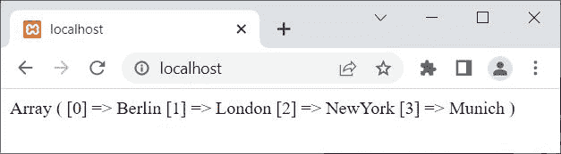

# 函数的作用

> 原文：<https://codescracker.com/php/php-print-r-function.htm>

PHP **print_r()** 函数用来打印指定变量的信息，看起来更具可读性。 例如:

```
<?php
   $x = array("Berlin", "London", "NewYork", "Munich");
   print_r($x);
?>
```

上面 PHP 示例在 **print_r()** 函数上的输出是:



参见 **$x** 的输出，一个[数组](/php/php-arrays.htm)变量。我们可以清楚地看到，在 索引 **0** ，存储了**柏林**。类似地，在索引 1 处，存储**伦敦**，依此类推。 也就是说，如果你使用下面的 PHP 语句:

```
echo $x[0];
```

然后你会得到**柏林**作为输出。

## PHP `print_r()`语法

PHP 中 **print_r()** 函数的语法是:

```
print_r(variable, return)
```

第一个参数(**变量**)是必需的，而第二个参数(**返回**)是可选的。

**注-****变量**参数用于指定变量，我们需要打印该变量的 信息。

**注-****返回**参数的默认值为**假**。但是如果我们将这个参数 指定为 **true** ，那么函数 **print_r()** 返回信息，不打印。

**注-** 如果**变量**参数是一个*整型*、*浮点型*，或者是一个*字符串型*类型 值，那么函数 **print_r()** 会打印该值本身。而如果**变量**参数为 一个*数组*或*对象*，则以 *键*和*元素*的形式返回**变量**的信息。

[PHP 在线测试](/exam/showtest.php?subid=8)

* * *

* * *