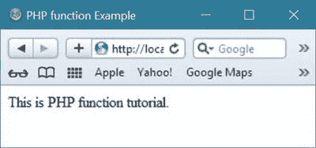

# PHP 函数

> 原文：<https://codescracker.com/php/php-functions.htm>

[PHP](/php/index.htm) 真正的强大来自于它的函数。在 PHP 中有超过 1000 个内置函数可用，这足以执行很多任务。

## PHP5 函数

您可以自由创建自己的函数(用户定义的函数)。函数基本上是一个代码块，可以用来执行程序中的某些特定任务。

## 在 PHP 中创建一个函数

PHP 中的函数是借助 function 关键字创建的。下面是在 PHP 中声明函数的一般形式:

```
function functionName()
{
   code to be executed here;
}
```

这里，function 是在 PHP 中声明函数时使用的关键字，functionName 是函数的名称。您可以给函数起一个以字母或下划线开头的名字(但不能以数字开头)。

## PHP 函数示例

下面是一个示例，创建一个名为 writeMsg()的函数，将消息作为输出写入:

```
<!DOCTYPE html>
<html>
<head>
   <title>PHP function Example</title>
</head>
<body>
<?php
   function writeMsg()
   {
      echo "This is PHP function tutorial.";
   }
   writeMsg();
?>
</body>
</html>
```

下面是上面的 PHP 脚本产生的输出:



在 PHP 中，带参数的函数称为参数化函数。

下面是另一个例子，在 PHP 中使用带参数的函数:

```
<html>
<head>
   <title>Writing PHP Function with Parameters</title>
</head>
<body>
<?php
   function addFunction($num1, $num2)
   {
      $sum = $num1 + $num2;
      echo "Sum of the passed numbers is : $sum";
   }
   addFunction(100, 200);
?>
</body>
</html>
```

下面是这个 PHP 脚本的输出:


让我们再举一个例子，用参数来演示 PHP 中的函数。

```
<html>
<head>
   <title>Function Example in PHP</title>
</head>
<body>
<?php
   function printTable($num)
   {
      for($i=1;$i<=10;$i++)
      {
         echo $num*$i;
         echo " ";
      }
   }
   printTable(2);
   echo "<br/>";
   printTable(3);
   echo "<br/>";
   printTable(4);
   echo "<br/>";
?>
</body>
</html>
```

下面是 PHP 示例中上述参数化函数产生的示例输出。


[PHP 在线测试](/exam/showtest.php?subid=8)

* * *

* * *