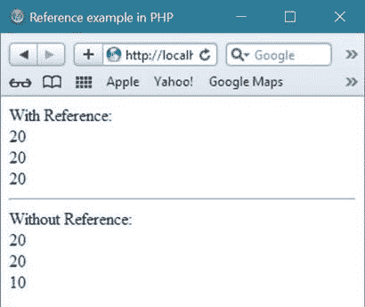

# PHP 参考

> 原文：<https://codescracker.com/php/php-references.htm>

[PHP](/php/index.htm) 中的引用允许两个不同的 [PHP 变量](/php/php-variables.htm) 写入相同的值，例如

```
$reference_var1 = &$reference_var2;
```

这里两个变量，即$reference_var1 和$reference_var2 相等。

你可以说，两个变量指向同一个地方。

## PHP 参考示例

让我们举一个例子来演示 PHP 中的引用。

```
<html>
<head>
   <title>PHP Reference Example</title>
</head>
<body>
<?php
   $num1 = 10;
   $num2 = &$num1;
   $sum = $num1 + $num2;
   echo $sum;
?>
</body>
</html>
```

下面是上面引用的 PHP 示例代码产生的示例输出。


## PHP 中引用的主要用途

如果您将任何变量(比如$first_ref_var)的引用分配给另一个变量(比如$second_ref_var)，那么如果您更改变量$first_ref_var 的值，那么$second_ref_var 的值也会自动更改，因为您已经分配了该变量的引用。

让我们再举一个例子来了解一下 PHP 中引用的主要用途。

```
<html>
<head>
   <title>Reference example in PHP</title>
</head>
<body>
<?php
   echo "With Reference:<br/>";
   // initialize first variable with value
   $num1 = 10;
   // initialize the reference of first variable to second variable
   $num2 = &$num1;
   $sum = $num1 + $num2;
   echo $sum;
   echo "<br/>";
   // change the value of first variable
   $num1 = 20;
   echo $num1;
   echo "<br/>";
   // you will see, the value of second variable will also be changed
   // this is the benefit of using reference in PHP
   echo $num2;
   echo "<hr/>";

   echo "Without Reference:<br/>";
   $var1 = 10;
   $var2 = $var1;
   $add = $var1 + $var2;
   echo $add;
   $var1 = 20;
   echo "<br/>";
   echo $var1;
   echo "<br/>";
   echo $var2;
?>
</body>
</html>
```

下面是上面的 PHP 参考示例的示例输出。



[PHP 在线测试](/exam/showtest.php?subid=8)

* * *

* * *