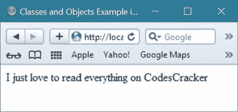
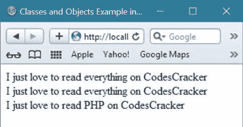
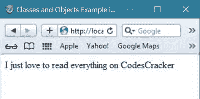
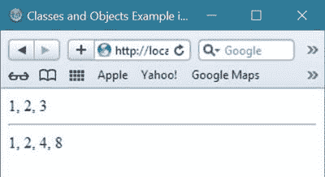

# PHP 类和对象

> 原文：<https://codescracker.com/php/php-classes-objects.htm>

在这里你将通过例子了解到 [PHP](/php/index.htm) 中的类和对象。

在 PHP 中，当编写长而重复的代码时，类和对象变得很有用，因为使用类和对象，您可以通过将 PHP 代码/程序中所有类似的任务组合起来，使您的代码更高效、更少重复。

## PHP 类

PHP 类是程序员定义的[数据类型](/php/php-data-types.htm)，它包括本地 [函数](/php/php-functions.htm)以及本地数据。

可以这么说，类包含方法和属性。

您可以使用类来定义一些特定的操作，只是为了构建对象。

## PHP 对象

在 PHP 中，创建和定义类之后，使用预定义的结构构建对象。

PHP 对象是由类定义的数据结构的一个单独的实例。

你定义一个类一次，然后可以创建许多属于它的对象。

您也可以将对象称为实例。

## PHP 类和对象示例

这是一个用 PHP 演示类和对象的例子。

```
<!DOCTYPE html>
<html>
<head>
   <title>Classes and Objects Example in PHP</title>
</head>
<body>
<?php
   class Like
   {
      public static function whatILike()
      {
         echo "I just love to read everything on CodesCracker";
      }
   }
   Like::whatILike();
?>
</body>
</html>
```

下面是上述类和对象示例代码的输出示例。



让我们在 PHP 中展开上面的类和对象示例代码。

```
<!DOCTYPE html>
<html>
<head>
   <title>Classes and Objects Example in PHP</title>
</head>
<body>
<?php
   class Like
   {
      public static function whatILike()
      {
         echo "I just love to read everything on CodesCracker";
      }
      public static function say()
      {
         self::whatILike();
      }
   }
   class LikeAnother extends Like 
   {
      public static function whatILike()
      {
         echo "I just love to read PHP on CodesCracker";
      }
   }
   Like::say();
   echo "<br/>";
   LikeAnother::say();
   echo "<br/>";
   LikeAnother::whatILike();
?>
</body>
</html>
```

下面是用 PHP 编写的上述类和对象示例代码产生的示例输出。



让我们再举一个例子来说明 PHP 中的类和对象。

```
<!DOCTYPE html>
<html>
<head>
   <title>Classes and Objects Example in PHP</title>
</head>
<body>
<?php
   class class_name
   {
      public function __construct(array $args_var=array())
      {
         if(!empty($args_var))
         {   
            foreach($args_var as $property_var=>$argument)
            {
               $this->{$property_var}=$argument;
            }
         }
      }
      public function __call($method, $args_var)
      {
         $args_var = array_merge(array("class_name" => $this), $args_var); 
         return call_user_func_array($this->{$method}, $args_var);
      }
   }
   $class_name_Object = new class_name();
   $class_name_Object->name = "Codes";
   $class_name_Object->surname = "Cracker";
   $class_name_Object->what = "everything";
   $class_name_Object->getInfo = function($class_name)
   {
      echo "I just love to read ".$class_name->what." on ".$class_name->name.$class_name->surname;
   };
   $class_name_Object->getInfo();
?>
</body>
</html>
```

下面是上面的类和对象示例程序产生的示例输出。



这是 PHP 中类和对象的另一个例子。

```
<!DOCTYPE html>
<html>
<head>
   <title>Classes and Objects Example in PHP</title>
</head>
<body>
<?php
   class EnumClass
   {
      protected $self_var = array();
      public function __construct()
      {
         $arguments_var = func_get_args();
         for($i=0,$n=count($arguments_var); $i<$n; $i++)
         {
            $this->adding_fun($arguments_var[$i]);
         }
      }
      public function __get($name=null)
      {
         return $this->self_var[$name];
      }
      public function adding_fun($name=null, $enumVar=null)
      {
         if(isset($enumVar))
         {
            $this->self_var[$name]=$enumVar;
         }
         else
         {
            $this->self_var[$name]=end($this->self_var)+1;
         }
      }
   }
   class FlagsEnumClass extends EnumClass
   {
      public function __construct()
      {
         $arguments_var=func_get_args();
         for($i=0,$n=count($arguments_var),$f=0x1; $i<$n; $i++,$f*=0x2)
         {
            $this->adding_fun($arguments_var[$i], $f);
         }
      }
   }
   // this will print 1, 2, 3
   $tutorials = new EnumClass("PHP", "HTML", "CSS");
   echo $tutorials->PHP . ", ";
   echo $tutorials->HTML . ", ";
   echo $tutorials->CSS;

   echo "<hr/>";

   // this will print 1, 2, 4, 8
   $thisTutorialTopic = new FlagsEnumClass("PHP", "Classes", "Objects", "Examples");
   echo $thisTutorialTopic->PHP . ", ";
   echo $thisTutorialTopic->Classes . ", ";
   echo $thisTutorialTopic->Objects . ", ";
   echo $thisTutorialTopic->Examples;
?>
</body>
</html>
```

上面 PHP 中类和对象的示例代码将产生如下输出:



[PHP 在线测试](/exam/showtest.php?subid=8)

* * *

* * *